* Table of Contents
{:toc}

--------------------------------------------------------------------------------------------------------------------

## **Acknowledgements**

* {list here sources of all reused/adapted ideas, code, documentation, and third-party libraries -- include links to the original source as well}

--------------------------------------------------------------------------------------------------------------------

## **Setting up, getting started**

Refer to the guide [_Setting up and getting started_](SettingUp.md).

--------------------------------------------------------------------------------------------------------------------

## **Design**

<div markdown="span" class="alert alert-primary">

:bulb: **Tip:** The `.puml` files used to create diagrams in this document `docs/diagrams` folder. Refer to the [_PlantUML Tutorial_ at se-edu/guides](https://se-education.org/guides/tutorials/plantUml.html) to learn how to create and edit diagrams.
</div>

### Architecture


The ***Architecture Diagram*** given above explains the high-level design of the App.

Given below is a quick overview of main components and how they interact with each other.

**Main components of the architecture**

**`Main`** (consisting of classes [`Main`](https://github.com/se-edu/addressbook-level3/tree/master/src/main/java/seedu/address/Main.java) and [`MainApp`](https://github.com/se-edu/addressbook-level3/tree/master/src/main/java/seedu/address/MainApp.java)) is in charge of the app launch and shut down.
* At app launch, it initializes the other components in the correct sequence, and connects them up with each other.
* At shut down, it shuts down the other components and invokes cleanup methods where necessary.

The bulk of the app's work is done by the following four components:

* [**`UI`**](#ui-component): The UI of the App.
* [**`Logic`**](#logic-component): The command executor.
* [**`Model`**](#model-component): Holds the data of the App in memory.
* [**`Storage`**](#storage-component): Reads data from, and writes data to, the hard disk.

[**`Commons`**](#common-classes) represents a collection of classes used by multiple other components.

**How the architecture components interact with each other**

The *Sequence Diagram* below shows how the components interact with each other for the scenario where the user issues the command `delete 1`.

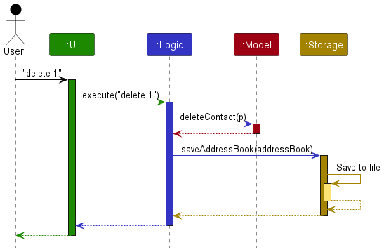

Each of the four main components (also shown in the diagram above),

* defines its *API* in an `interface` with the same name as the Component.
* implements its functionality using a concrete `{Component Name}Manager` class (which follows the corresponding API `interface` mentioned in the previous point.

For example, the `Logic` component defines its API in the `Logic.java` interface and implements its functionality using the `LogicManager.java` class which follows the `Logic` interface. Other components interact with a given component through its interface rather than the concrete class (reason: to prevent outside component's being coupled to the implementation of a component), as illustrated in the (partial) class diagram below.


The sections below give more details of each component.

### UI component

The **API** of this component is specified in [`Ui.java`](https://github.com/se-edu/addressbook-level3/tree/master/src/main/java/seedu/address/ui/Ui.java)

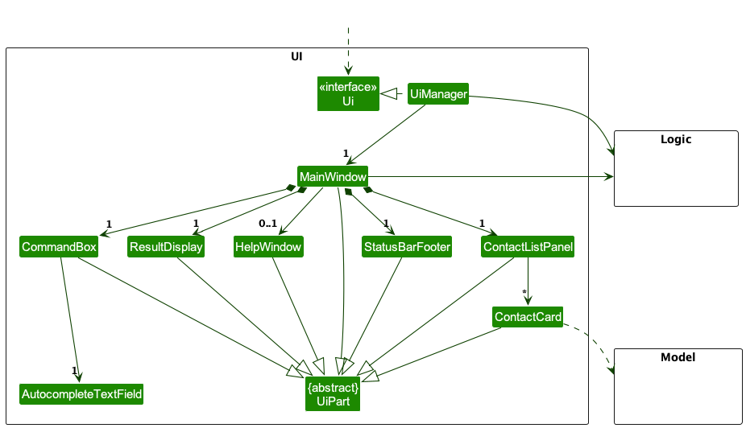

The UI consists of a `MainWindow` that is made up of parts e.g.`CommandBox`, `ResultDisplay`, `PersonListPanel`, `StatusBarFooter` etc. All these, including the `MainWindow`, inherit from the abstract `UiPart` class which captures the commonalities between classes that represent parts of the visible GUI.

The `UI` component uses the JavaFx UI framework. The layout of these UI parts are defined in matching `.fxml` files that are in the `src/main/resources/view` folder. For example, the layout of the [`MainWindow`](https://github.com/se-edu/addressbook-level3/tree/master/src/main/java/seedu/address/ui/MainWindow.java) is specified in [`MainWindow.fxml`](https://github.com/se-edu/addressbook-level3/tree/master/src/main/resources/view/MainWindow.fxml)

The `UI` component,

* executes user commands using the `Logic` component.
* listens for changes to `Model` data so that the UI can be updated with the modified data.
* keeps a reference to the `Logic` component, because the `UI` relies on the `Logic` to execute commands.
* depends on some classes in the `Model` component, as it displays `Person` object residing in the `Model`.

### Logic component

**API** : [`Logic.java`](https://github.com/se-edu/addressbook-level3/tree/master/src/main/java/seedu/address/logic/Logic.java)

Here's a (partial) class diagram of the `Logic` component:


The sequence diagram below illustrates the interactions within the `Logic` component, taking `execute("delete 1")` API call as an example.


<div markdown="span" class="alert alert-info">:information_source: **Note:** The lifeline for `DeleteCommandParser` should end at the destroy marker (X) but due to a limitation of PlantUML, the lifeline reaches the end of diagram.
</div>

How the `Logic` component works:

1. When `Logic` is called upon to execute a command, it is passed to an `AppParser` object which in turn creates a parser that matches the command (e.g., `DeleteCommandParser`) and uses it to parse the command.
1. This results in a `Command` object (more precisely, an object of one of its subclasses e.g., `DeleteCommand`) which is executed by the `LogicManager`.
1. The command can communicate with the `Model` when it is executed (e.g. to delete a contact).
1. The result of the command execution is encapsulated as a `CommandResult` object which is returned back from `Logic`.

Here are the other classes in `Logic` (omitted from the class diagram above) that are used for parsing a user command:

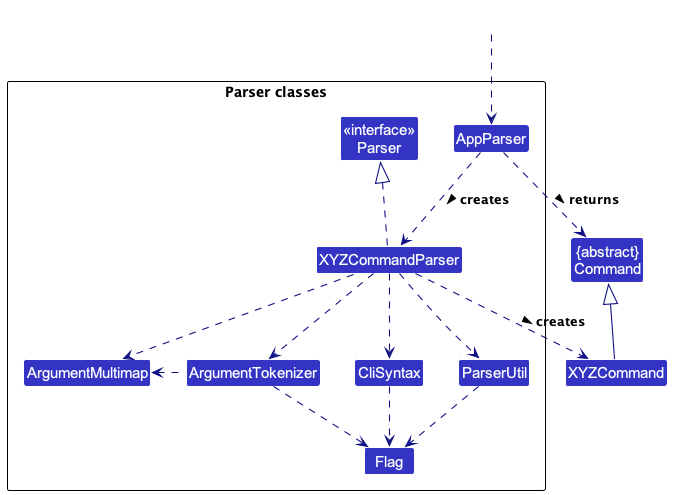

How the parsing works:
* When called upon to parse a user command, the `AppParser` class creates an `XYZCommandParser` (`XYZ` is a placeholder for the specific command name e.g., `AddCommandParser`) which uses the other classes shown above to parse the user command and create a `XYZCommand` object (e.g., `AddCommand`) which the `AppParser` returns back as a `Command` object.
* All `XYZCommandParser` classes (e.g., `AddCommandParser`, `DeleteCommandParser`, ...) inherit from the `Parser` interface so that they can be treated similarly where possible e.g, during testing.

How arguments from a raw command input may be obtained by parsers:
* When arguments are needed for a command, `ArgumentTokenizer` is used to prepare and tokenize the raw input string, which can then convert it to an `ArgumentMultimap` for easy access.
* An `ArgumentMultimap` represents the command data (which has the format `name preamble text --flag1 value 1 --flag2 value 2`) in their distinct fields: **preamble**, **flags** and their mapped **values**. Note that as a multimap, multiple values can be mapped to the same flag.
* All parsers can use the `ArgumentMultimap` (obtained from using the raw input on `ArgumentTokenizer`) to access the required arguments to create and execute a `Command`.

### Model component
**API** : [`Model.java`](https://github.com/se-edu/addressbook-level3/tree/master/src/main/java/seedu/address/model/Model.java)

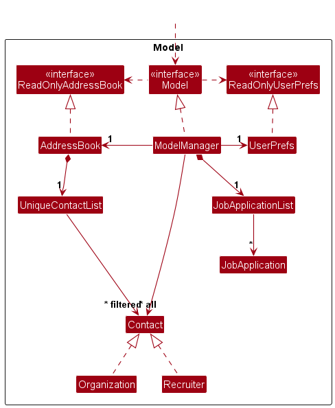


The `Model` component,

* stores the address book data i.e., all `Person` objects (which are contained in a `UniquePersonList` object).
* stores the currently 'selected' `Person` objects (e.g., results of a search query) as a separate _filtered_ list which is exposed to outsiders as an unmodifiable `ObservableList<Person>` that can be 'observed' e.g. the UI can be bound to this list so that the UI automatically updates when the data in the list change.
* stores a `UserPref` object that represents the user’s preferences. This is exposed to the outside as a `ReadOnlyUserPref` objects.
* does not depend on any of the other three components (as the `Model` represents data entities of the domain, they should make sense on their own without depending on other components)

<div markdown="span" class="alert alert-info">:information_source: **Note:** An alternative (arguably, a more OOP) model is given below. It has a `Tag` list in the `AddressBook`, which `Person` references. This allows `AddressBook` to only require one `Tag` object per unique tag, instead of each `Person` needing their own `Tag` objects.<br>

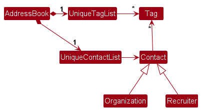

</div>


### Storage component

**API** : [`Storage.java`](https://github.com/se-edu/addressbook-level3/tree/master/src/main/java/seedu/address/storage/Storage.java)

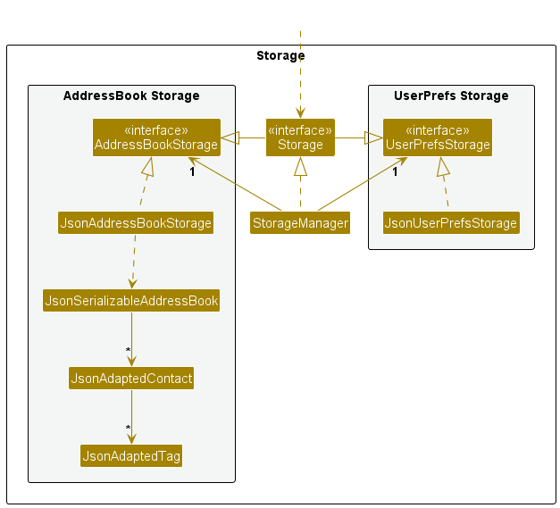

The `Storage` component,
* can save both address book data and user preference data in JSON format, and read them back into corresponding objects.
* inherits from both `AddressBookStorage` and `UserPrefStorage`, which means it can be treated as either one (if only the functionality of only one is needed).
* depends on some classes in the `Model` component (because the `Storage` component's job is to save/retrieve objects that belong to the `Model`)

### Common classes

Classes used by multiple components are in the `seedu.addressbook.commons` package.

--------------------------------------------------------------------------------------------------------------------

## **Implementation**

This section describes some noteworthy details on how certain features are implemented.

### Add Recruiter and Recruiter-Organization Link Feature
The `Recruiter` class is a `Contact` that can have a link to zero or one `Organization` that exists within the `AddressBook`.

As it extends the `Contact` class, it inherits all the fields present in `Contact` and also accepts an additional `Organization`. The accepted organization represents an immutable link between the recruiter and the given organization.

To represent this relationship within the existing Model, `Contact` was modified to accept another `Contact` which serves as its parent. The parent contact can be retrieved via `Contact#getParent()`.

As this represents a Contact-Contact relationship, `Recruiter` overrides the getter method and cast the parent contact to an `Organization` so that it better represents the Recruiter-Organization relationship.

To store this relationship in a JSON format, the unique `Id` of the linked organization is stored as an oid attribute on the recruiter. Hence, when the application is launched again, the `oid` is used to identify the organization in the `AddressBook`. This means that all organizations must be parsed and added to the `AddressBook` before `Storage` parses the JSON data for the recruiters. Thus, each time `AddressBook` is written to storage, it is sorted, placing all organizations before recruiters. 

Given below is an example usage scenario and how a recruiter can be linked to an existing organization at each step.

Step 1: The user launches the application. Assume that the `AddressBook` contains a single unlinked organization with the `Id` that has a value of "alex_yeoh" and no recruiters.

Step 2: The user executes `add --rec --name Ryan --oid alex_yeoh`. The add command parses the `--rec` flag and knows the user wishes to create a recruiter. It also parses "alex_yeoh" as the `Id of the organization the recruiter will be linked to.

The `AddRecruiterCommand` will attempt to retrieve a `Contact` that has the `Id` "alex_yeoh" and pass it into the new `Recruiter` that will be added to the AddressBook

Once done, the UI will display the link as a single line: `from organization (alex_yeoh)`

On the other hand, the Organization class can have links to multiple Recruiters. Hence, a single parent Contact can have multiple children contacts.

### Command Autocompletion

#### Overview

Jobby's Command Autocompletion is designed to provide users with intelligent command suggestions and offer autocompletion by analyzing the existing partial command input and the current application state.

Just like programming IDEs, a user may type a prefix subsequence of a long command part, and simply press **TAB** to finish the command using the suggested match.

It consists of several key components:

- **`AutocompleteSupplier`**:
  - This class is responsible for generating possible flags and values to be used for suggestions.
  - It takes an `AutocompleteDataSet` of flags, an optional `FlagValueSupplier` mapped to each flag, and can have corresponding `AutocompleteConstraint` applied to flags.
  - It helps determine what flags can be added to an existing command phrase based on constraints and existing flags.

- **`AutocompleteGenerator`**:
  - This component takes in an `AutocompleteSupplier` or a `Supplier<Stream<String>>` and generates autocomplete results based on a partial command input and the current application model.
  - Users can invoke `AutocompleteGenerator#generateCompletions(command, model)` to get autocomplete suggestions.
  - It does the hard work of taking the possible values provided by either supplier, performing subsequence fuzzy match, and then "predict" what the user is typing.


#### `AutocompleteConstraint`

The `AutocompleteConstraint` class provides a way to specify rules for autocomplete suggestions. It is a functional interface, so it can be treated as a lambda function.

It offers static factory methods for quickly defining common rulesets. Examples include:
- `#oneAmongAllOf(items...)`: Specifies that one of the provided items must be present in the command.
- `#onceForEachOf(items...)`: Ensures that each of the provided items can only appear once in the command.
- `#where(item)#isPrerequisiteFor(dependents...)`: Defines dependencies between items, indicating that certain flags are prerequisites for others.
- `#where(item)#cannotExistAlongsideAnyOf(items...)`: Defines that an item cannot be present when any of the others are present.

#### `AutocompleteDataSet`

The `AutocompleteDataSet` is a set of flags that retains knowledge of which flags have what rules and constraints. It helps determine which flags can be added to an existing set of flags given the known constraints.

This dataset can be constructed manually with flags and constraints, but it also offers static factory methods for quick creation of flag sets with common constraints. For example:
- `#oneAmongAllOf(items...)`: Creates a set where at most one out of all the provided items may appear.
- `#onceForEachOf(items...)`: Ensures that each of the provided items can appear only once.
- `#anyNumberOf(items...)`: Creates a set with the rule that items in the set may appear any number of times.

Additionally, some helper operations are provided in a chainable fashion. For example:
- `#concat(sets...)`: Combines sets together to create complex combinations of flag rules and flags.
- `#addDependents(items...)`: Establishes dependencies between flags. This way, flag may require another flag to exist in order to be used.
- `#addConstraints(constraints...)`: Adds more custom constraints as desired.

Finally, we need a way to compute what items are usable given existing set of items that are present. This class exposes one such method:
- `#getElementsAfterConsuming(items...)`: Gets the remaining set of elements after "consuming" the given ones.

#### `FlagValueSupplier`

The `FlagValueSupplier` interface is a simple one that behaves like a lambda function with one task: Given a partial command for a flag and the app's **model** generate all possible suggestion results.

By taking in both the command and the app model, it is possible to specify arbitrary suppliers with any data, even from the model itself, like corresponding Id values when using the `--oid` flag for recruiters.

#### `AutocompleteSupplier`

The `AutocompleteSupplier` leverages the capabilities of `AutocompleteDataSet` and `FlagValueSupplier`.

Internally, it uses `AutocompleteDataSet` to determine what flags can be added after a given set of flags has been used in a command.

This allows it to make suggestions based on constraints like "`--org` cannot exist together with `--rec`."

Additionally, it uses `FlagValueSupplier` to provide suggestions for flags with preset values, such as "`--status pending`."

#### `AutocompleteGenerator`

The `AutocompleteGenerator` serves as a wrapper for autocomplete functionality, regardless of it's source.

It takes an `AutocompleteSupplier` or a `Supplier<Stream<String>` and generates autocomplete suggestions.

Once initialized, users can call `AutocompleteGenerator#generateCompletions(command, model)` to receive suggestions from their partial command input.


#### Design Considerations

When designing the Autocomplete feature, important considerations include the ability to flexibly define and craft new constraints based on heuristically determined rules.

By abstracting away all operations into simple components like sets and constraints, the current carefully crafted design allows
Jobby's Command Autocompletion to provide context-aware suggestions to users, while adhering to simple constraints defined on a per command basis.

Most notably, it also allows for advanced rulesets to be specified in a human-readable fashion.
Take a look at [AddCommand#AUTOCOMPLETE_SUPPLIER](https://github.com/AY2324S1-CS2103T-W08-3/tp/blob/c484696fe4c12d514ad3fb6a71ff2dfea089fe32/src/main/java/seedu/address/logic/commands/AddCommand.java#L47).


### \[Proposed\] Undo/redo feature

#### Proposed Implementation

The proposed undo/redo mechanism is facilitated by `VersionedAddressBook`. It extends `AddressBook` with an undo/redo history, stored internally as an `addressBookStateList` and `currentStatePointer`. Additionally, it implements the following operations:

* `VersionedAddressBook#commit()` — Saves the current address book state in its history.
* `VersionedAddressBook#undo()` — Restores the previous address book state from its history.
* `VersionedAddressBook#redo()` — Restores a previously undone address book state from its history.

These operations are exposed in the `Model` interface as `Model#commitAddressBook()`, `Model#undoAddressBook()` and `Model#redoAddressBook()` respectively.

Given below is an example usage scenario and how the undo/redo mechanism behaves at each step.

Step 1. The user launches the application for the first time. The `VersionedAddressBook` will be initialized with the initial address book state, and the `currentStatePointer` pointing to that single address book state.


Step 2. The user executes `delete 5` command to delete the 5th contact in the address book. The `delete` command calls `Model#commitAddressBook()`, causing the modified state of the address book after the `delete 5` command executes to be saved in the `addressBookStateList`, and the `currentStatePointer` is shifted to the newly inserted address book state.


Step 3. The user executes `add n/David …​` to add a new contact. The `add` command also calls `Model#commitAddressBook()`, causing another modified address book state to be saved into the `addressBookStateList`.


<div markdown="span" class="alert alert-info">:information_source: **Note:** If a command fails its execution, it will not call `Model#commitAddressBook()`, so the address book state will not be saved into the `addressBookStateList`.

</div>

Step 4. The user now decides that adding the contact was a mistake, and decides to undo that action by executing the `undo` command. The `undo` command will call `Model#undoAddressBook()`, which will shift the `currentStatePointer` once to the left, pointing it to the previous address book state, and restores the address book to that state.


<div markdown="span" class="alert alert-info">:information_source: **Note:** If the `currentStatePointer` is at index 0, pointing to the initial AddressBook state, then there are no previous AddressBook states to restore. The `undo` command uses `Model#canUndoAddressBook()` to check if this is the case. If so, it will return an error to the user rather
than attempting to perform the undo.

</div>

The following sequence diagram shows how the undo operation works:


<div markdown="span" class="alert alert-info">:information_source: **Note:** The lifeline for `UndoCommand` should end at the destroy marker (X) but due to a limitation of PlantUML, the lifeline reaches the end of diagram.

</div>

The `redo` command does the opposite — it calls `Model#redoAddressBook()`, which shifts the `currentStatePointer` once to the right, pointing to the previously undone state, and restores the address book to that state.

<div markdown="span" class="alert alert-info">:information_source: **Note:** If the `currentStatePointer` is at index `addressBookStateList.size() - 1`, pointing to the latest address book state, then there are no undone AddressBook states to restore. The `redo` command uses `Model#canRedoAddressBook()` to check if this is the case. If so, it will return an error to the user rather than attempting to perform the redo.

</div>

Step 5. The user then decides to execute the command `list`. Commands that do not modify the address book, such as `list`, will usually not call `Model#commitAddressBook()`, `Model#undoAddressBook()` or `Model#redoAddressBook()`. Thus, the `addressBookStateList` remains unchanged.


Step 6. The user executes `clear`, which calls `Model#commitAddressBook()`. Since the `currentStatePointer` is not pointing at the end of the `addressBookStateList`, all address book states after the `currentStatePointer` will be purged. Reason: It no longer makes sense to redo the `add n/David …​` command. This is the behavior that most modern desktop applications follow.


The following activity diagram summarizes what happens when a user executes a new command:


#### Design considerations:

**Aspect: How undo & redo executes:**

* **Alternative 1 (current choice):** Saves the entire address book.
  * Pros: Easy to implement.
  * Cons: May have performance issues in terms of memory usage.

* **Alternative 2:** Individual command knows how to undo/redo by
  itself.
  * Pros: Will use less memory (e.g. for `delete`, just save the contact being deleted).
  * Cons: We must ensure that the implementation of each individual command are correct.

_{more aspects and alternatives to be added}_

### \[Proposed\] Adding Organization

#### Proposed Implementation

The proposed AddOrganization mechanism is facilitated by `AddOrganization`. It extends `AddContact`.

These operations are parsed in the `AddCommandParser` class, where the user inputs e.g. `add --org --name Google` will be handled and saved into the JSON database and displayed in the GUI.

Given below is an example usage scenario and how the `AddOrganization` mechanism behaves at each step.

Step 1. The user inputs an add organization command. The `AddCommandParser` will check for `--org` flag, and parse the input as an `Organization`.

Step 2. This triggers the `AddOrganizationCommand`, where a new `Organization` object will be created. And it will be pased down into `JsonAdaptedContact` and `ModelManager` to be converted into JSON data and be displayed into the GUI respectively.

Step 3. When the user want decide to add more information regarding the Organization, he can use the `Edit` command, which will be handled by the `EditCommandParser`. And the added field will be passed down into into `JsonAdaptedContact` and `ModelManager` to be converted into JSON data and be displayed into the GUI respectively.

#### Design considerations:

**Aspect: How Add Organization executes:**

* **Alternative 1 (current choice):** Adds the Organization with a JSON's key 'type': "Organization"
    * Pros: Easy to implement and flexible to implement more types.
    * Cons: NIL


### \[Proposed\] Data archiving

_{Explain here how the data archiving feature will be implemented}_

### Apply feature
The apply feature makes use of existing structures to function, notably the `Parser`, `Model` and `Storage`

The following sequence diagram shows how job applications are added to Jobby

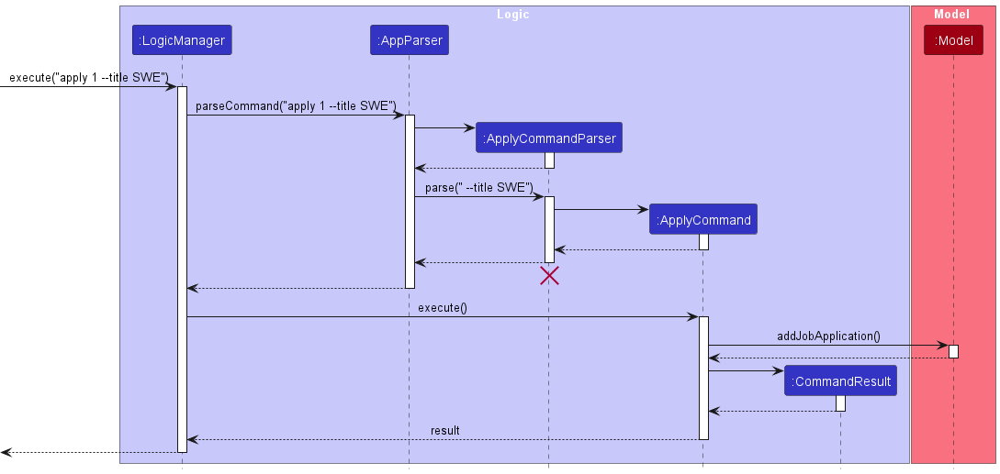

#### Design Considerations
**Aspect: How to store applications**

* **Actual: Applications are stored as a JSON array belonging to their respective organizations**
  * Pros: Easy to implement
  * Cons: Need to initialise a list of job applications from every organization every time on startup. 

* **Alternative 1: Applications are stored as a JSON array separate from the contacts**
  * Pros: Applications can be loaded immediately into Jobby without waiting for organizations to be initialised.
  * Cons: Can have complications on other features, such as identifying which applications belong to which organizations.

**Aspect: How to show applications**

* **Actual: Applications are shown on a separate list**
  * Pros: Easy to implement, less command needed to switch view from split view.
  * Cons: Requires syncing the list with organizations, since there is no guarantee that the applications in the UI list are the same as all the ones in organizations.

* **Alternative 1: Use a command to switch list view**
  * Pros: More compact, does not require larger screen size.
  * Cons: More difficult to implement, requires a command that directly changes the UI.

**Aspect: What should the command syntax be**

* **Actual: Use a separate command for adding applications**
  * Pros: Easier to type out the command, does not require a lot of typing.
  * Cons: More implementation effort, to implement a new command with new parser.
* **Alternative 1: Reuse add command**
  * Pros: Easier to implement, can make use of existing structures surrounding the add command.
  * Cons: Overloading the add command too much.


--------------------------------------------------------------------------------------------------------------------

## **Documentation, logging, testing, configuration, dev-ops**

* [Documentation guide](Documentation.md)
* [Testing guide](Testing.md)
* [Logging guide](Logging.md)
* [Configuration guide](Configuration.md)
* [DevOps guide](DevOps.md)

--------------------------------------------------------------------------------------------------------------------

## **Appendix: Requirements**

### Product scope

**Target user profile**:

* students looking to apply for jobs
* have a need to manage a significant number of organization and recruiter contacts and application statuses
* prefer desktop apps over other types
* can type fast
* prefers typing to mouse interactions
* is reasonably comfortable and familiar with using CLI apps

**Value proposition**:

Allows for comprehensive tracking of job applications and the information of companies and recruiters the user may be interested in, and manage them faster than a typical mouse/GUI driven app


### User stories

Priorities: High (must have) - `* * *`, Medium (nice to have) - `* *`, Low (unlikely to have) - `*`

| Priority | As a(n) ...    | I want to ...                                                | So that I can ...                                                          |
|----------|----------------|--------------------------------------------------------------|----------------------------------------------------------------------------|
| `* * *`  | new user       | see usage instructions                                       | refer to instructions when I forget how to use the app                     |
| `* * *`  | user           | adding a job application                                     | keep track which organization I am applying to                             |
| `* * *`  | user           | delete a job application                                     | remove job applications that I no longer need to track                     |
| `* * *`  | user           | add a new contact                                            | keep track of organizations and recruiters I'm interested in               |
| `* * *`  | user           | delete contacts                                              | remove organizations and recruiters that I no longer need                  |
| `* * *`  | user           | edit my job application via index                            | be up to date with changes in the job application                          |
| `* *`    | user           | edit my contacts via index and id                            | be up to date with changes in organization and recruiter details           |
| `* *`    | user           | find contacts by saved details                               | locate a contact without going through the entire list                     |
| `* *`    | user           | find job applications by details                             | locate a job application without going through the entire list             |
| `* *`    | user           | link recruiters and job application to organizations         | see where the recruiter comes from and where I am applying to              |
| `* *`    | user           | sort job applications by deadlines                           | be able to which job application is most urgent                            |
| `* *`    | user           | sort job applications by last updated time                   | be able to see which job applications have gone cold                       |
| `* *`    | user           | find organizations which have no job applications            | get a summary of the organizations that I should apply to                  |
| `* *`    | user           | tag contacts                                                 | organize my contact list for more efficient access of different categories |
| `* *`    | efficient user | type shorter arguments and known values with auto-completion | type my command even more quickly                                          |
| `*`      | user           | import and export contacts                                   | share my list of contacts with my peers                                    |

### Use cases

(For all use cases below, the **System** is `Jobby` and the **Actor** is the `user`, unless specified otherwise)


**Use case: Add an application**

**MSS**

1.  User requests to add an application
2.  Jobby adds the application into the specified organization
3.  Jobby shows that the application has been added

    Use case ends.

**Extensions**

* 1a. The given application does not match to any Organization
    * 1a1. Jobby shows an error message.
    Use case ends.


**Use case: Edit a contact**

**MSS**

1.  User requests to edit a contact
2.  Jobby edits the contact
    Use case ends.

**Extensions**

* 1a. The given request does not match with any contact.
    * 1a1. Jobby shows an error message. 
    
      Use case ends.


**Use case: Delete a contact**

**MSS**

1.  User requests to list organizations
2.  Jobby shows a list of organizations
3.  User requests to delete a specific organization in the list
4.  Jobby deletes the organization

    Use case ends.

**Extensions**

* 2a. The list is empty.
  Use case ends.

* 3a. The given index is invalid.
    * 3a1. Jobby shows an error message.
  
      Use case resumes at step 2.

* 3b. The given ID does not match to any organization.
    * 3b1. Jobby shows an error message.
  
      Use case resumes at step 2.

* 4a. The user has specified to delete recursively.
    * 4a1. Jobby deletes all recruiter contacts associated with the recruiter (WIP)
  
      Use case ends.


**Use case: List contacts**

**MSS**

1.  User requests to list contacts
2.  Jobby shows a list of contacts

    Use case ends.

**Extensions**

* 1a. User requests to list organizations.
    * 1a1. Jobby shows a list of organizations.
  
      Use case ends.

* 1b. User requests to list recruiters.
    * 1b1. Jobby shows a list of recruiters.
  
      Use case ends.

**Use case: Find contacts**

**MSS**

1.  User requests to find contacts or applications
2.  Jobby shows a list of contacts or applications found

    Use case ends.

**Extensions**

* 1a. User requests to find organizations.
    * 1a1. Jobby shows a list of organizations that matches the search.
  
      Use case ends.

* 1b. User requests to list recruiters.
    * 1b1. Jobby shows a list of recruiters that matches the search.
  
      Use case ends.
  
* 1c. User requests to list.
    * 1c1. Jobby shows a list of application that matches the search.

      Use case ends.
  
* 1d. No match found.
    * 1d1. Jobby shows 0 matched result.
    
      Use case ends.


*{More to be added}*

### Non-Functional Requirements

1.  Should work on any _mainstream OS_ as long as it has Java `11` or above installed.
2.  Should be able to hold up to 1000 contacts without a noticeable sluggishness in performance for typical usage.
3.  A user with above average typing speed for regular English text (i.e. not code, not system admin commands) should be able to accomplish most of the tasks faster using commands than using the mouse.
4.  A user with familiarity with common Unix/Linux shell command syntax should find the syntax of Jobby to match their habits and easy to pick up.
5.  The command syntax should not conflict with something that a user could plausibly use as legitimate data input.


*{More to be added}*

### Glossary

* **Mainstream OS**: Windows, macOS, Linux, Unix
* **Commands**: A set of keywords that defines the operations the user wishes to execute.
* **Arguments**: A set of keywords that defines the type of data the user wishes to pass into the command line.

--------------------------------------------------------------------------------------------------------------------

## **Appendix: Instructions for manual testing**

Given below are instructions to test the app manually.

<div markdown="span" class="alert alert-info">:information_source: **Note:** These instructions only provide a starting point for testers to work on;
testers are expected to do more *exploratory* testing.

</div>


### Launch and shutdown

1. Initial launch

    1. Download the jar file and copy into an empty folder

    1. Double-click the jar file Expected: Shows the GUI with a set of sample contacts. The window size may not be optimum.

1. Saving window preferences

    1. Resize the window to an optimum size. Move the window to a different location. Close the window.

    1. Re-launch the app by double-clicking the jar file.<br>
   Expected: The most recent window size and location is retained. // TODO: Check if it is valid.

1. _{ more test cases …​ }_

### Resetting to default data for Jobby

1. Go to the folder where jobby.jar is located at
2. Delete the data directory.
3. Run jobby.jar

### Deleting a contact

1. Deleting a contact while all contacts are being shown

   1. Prerequisites: List all contacts using the `list` command. Multiple contacts in the list.

   1. Test case: `delete 1`<br>
      Expected: First contact is deleted from the list. Details of the deleted contact shown in the status message. Timestamp in the status bar is updated.

   1. Test case: `delete 0`<br>
      Expected: No contact is deleted. Error details shown in the status message. Status bar remains the same.

   1. Other incorrect delete commands to try: `delete`, `delete x`, `...` (where x is larger than the list size)<br>
      Expected: Similar to previous.

1. _{ more test cases …​ }_

### Saving data

1. Dealing with missing/corrupted data files

   1. _{explain how to simulate a missing/corrupted file, and the expected behavior}_

1. _{ more test cases …​ }_


--------------------------------------------------------------------------------------------------------------------

## **Appendix: Planned Enhancements**

### Do checks to ensure that old data is not the same as new data when editing data.

Currently, Jobby sometimes allow editing of data such that the old data to be replaced with has the same contents as the new data.

For example, `edit --application 1 --title SWE` on a job application with title "SWE" works, even though nothing is effectively changed.

This can be done with a simple fix. The execute method for the editing of job applications is as follows:

```java
    public CommandResult execute(Model model) throws CommandException {
        if (!editApplicationDescriptor.isAnyFieldEdited()) {
            throw new CommandException(MESSAGE_NOT_EDITED);
        }
        List<JobApplication> lastShownList = model.getDisplayedApplicationList();
        if (targetIndex.getZeroBased() >= lastShownList.size()) {
            throw new CommandException(Messages.MESSAGE_INVALID_APPLICATION_DISPLAYED_INDEX);
        }

        JobApplication jobApplication = lastShownList.get(targetIndex.getZeroBased());
        JobApplication newApplication = createApplication(jobApplication, editApplicationDescriptor);

        try {
            model.replaceApplication(targetIndex, newApplication);
        } catch (IllegalValueException e) {
            throw new CommandException(e.getMessage());
        }

        return new CommandResult(String.format(MESSAGE_EDIT_APPLICATION_SUCCESS, newApplication));
    }
```

We can easily add a new line to check if the all the contents of the new application is the same as the old one, and throw a CommandException if it is.

This can also be easily done for editing contacts.

### Make commands only take in arguments that are applicable to them and reject other extra arguments.

Currently, some commands with multiple modes share parameters between modes.

Example: The edit command has a contact mode and job application mode. In contact mode, `--name` is used to edit the name of the contact. However, there is no such thing for job application mode.

Yet, `edit --application 1 --name John --title SWE` works as long as a valid field that is used for job application is used, and ignores the extra arguments.

This can be done with a simple fix. Every command alreadly has a list of flags that are accepted. 

At the command parsing level, add additional checks against the list of flags provided by the command to ensure that every flag present in the command is applicable to the command used.

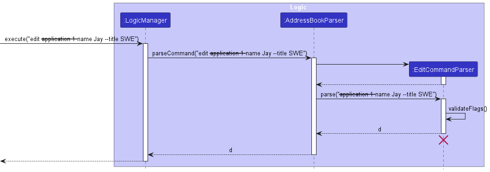

Note: Due to the limitations of PlantUML, `--application 1 --name Jay --title SWE` is interpreted as: ~~application 1~~ name Jay --title SWE

### Better Formatting for Contacts

Currently, the contacts are not nicely formatted and exposes some internal but non-critical implementation details.

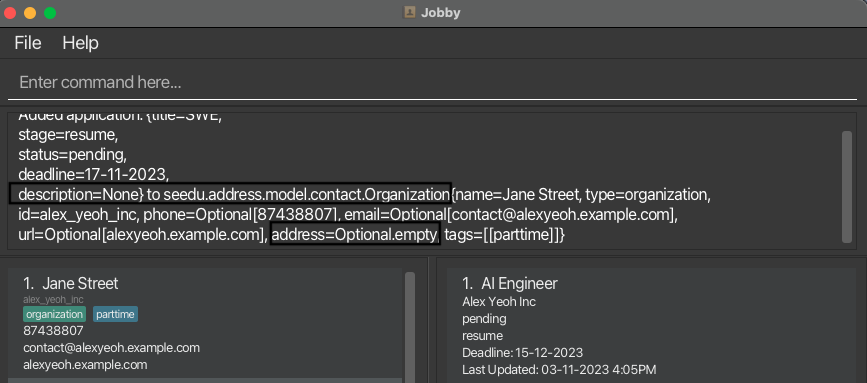

This is due to there not being a proper string conversion for the fields in the Contact class, especially when the fields which used to be compulsory are now optional.

In this case, it would be easy to address this problem, by using 
```java
optionalField.map(OptionalFieldClass::toString).orElse("None")
```

The Contact class can use the `Contact.getClass().getSimpleName()` method to get the type of the contact. Alternatively, it can use the `getType` method and use it for the class name, since the `getType` method matches the class name.

### Disallow values in fields where values are not required

Currently, Jobby accepts values for fields which do not require values. For example, `delete X --recursive` works as the command parser does not check if there is a value associated to the flag, but only checks if the flag exists.

In this case, it is simple to add a checker similar to [validating that only the allowed flags are present](#make-commands-only-take-in-arguments-that-are-applicable-to-them-and-reject-other-extra-arguments)


### Add confirmation to run destructive commands

Currently, Jobby does not warn users if they run a destructive command that cannot be undone, such as "clear", "delete" and "edit".

Users may then destroy their data by accident.

#### Proposed implementation

One way to implement warnings is to have the user input 2 commands for destructive commands:
* The actual command
* The confirmation command

Therefore, Jobby needs to be able to save the previous command to be able to execute it. One way is to store the command inside `LogicManager` and execute the command if the user enters a confirmation.


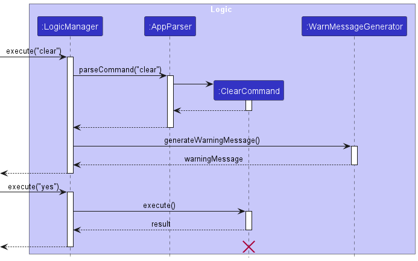

Step 1. The user executes a destructive command, such as `clear` to clear the data.

Step 2. The parser will check if the command is a valid command as usual, and creates the command to be executed later.

Step 3. The `LogicManager` checks that it is a destructive command (e.g. have commands implement a `isDestructive` method)

Step 4. If it is destructive, it will generate a warning message to the user, otherwise it will execute the command normally.

Step 5. The user confirms to continue with the command, which the `LogicManager` will execute the stored command. Otherwise, the `LogicManager` will not execute the command and removes the command.

An alternative implementation from the above diagram is to allow the `AppParser` to store the destructive command in the `AppParser` instead, and when parsing the confirmation command it will give the destructive command.

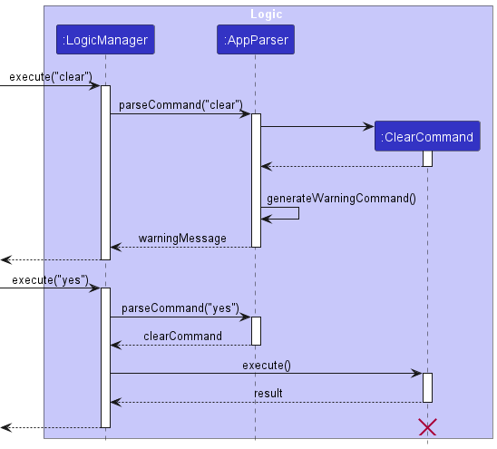
