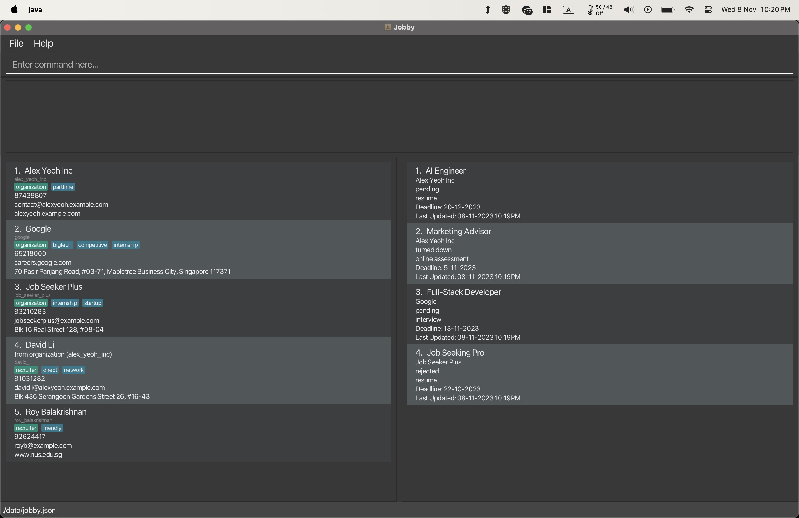
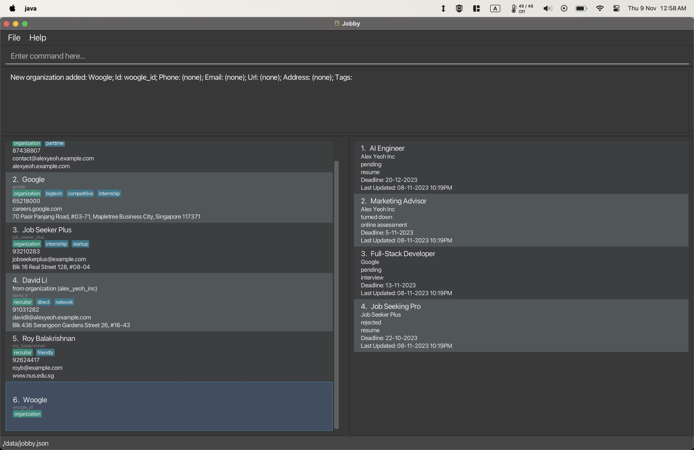
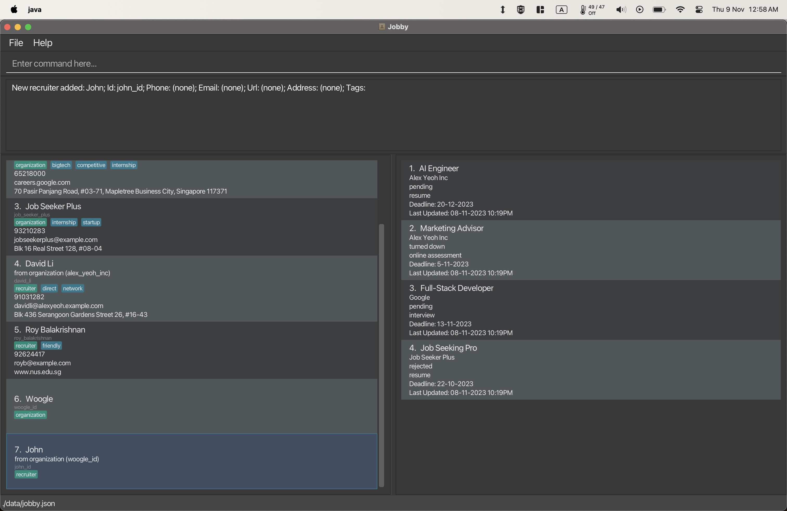
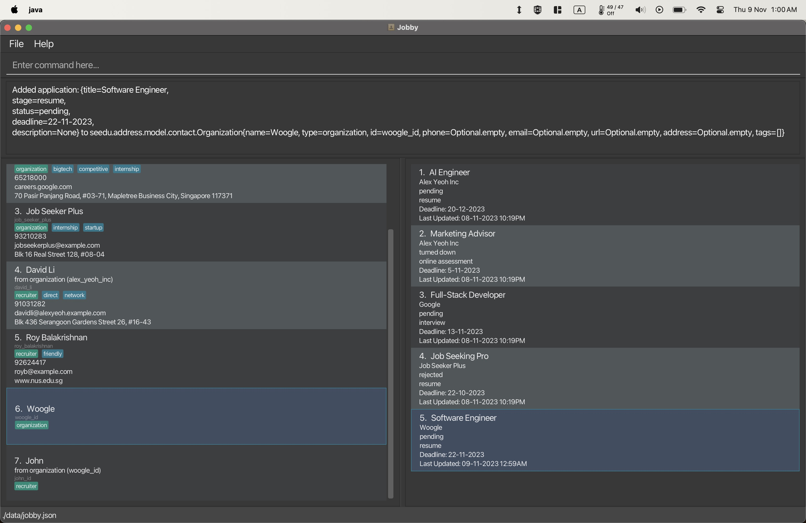
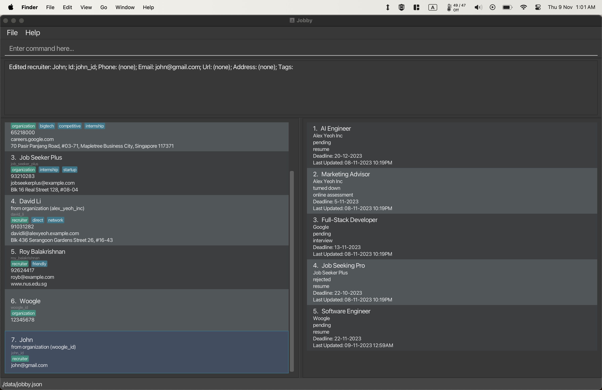
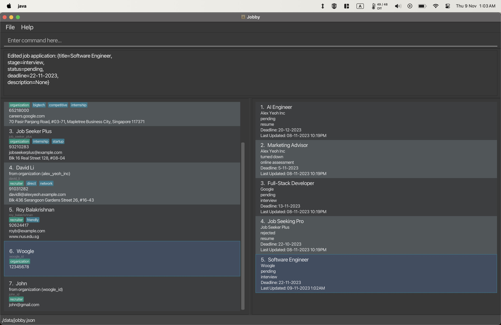
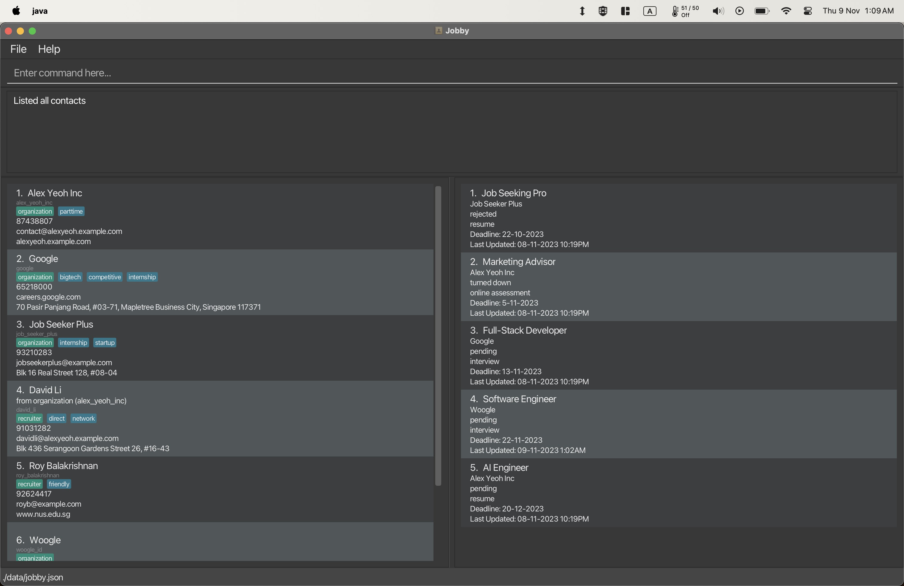
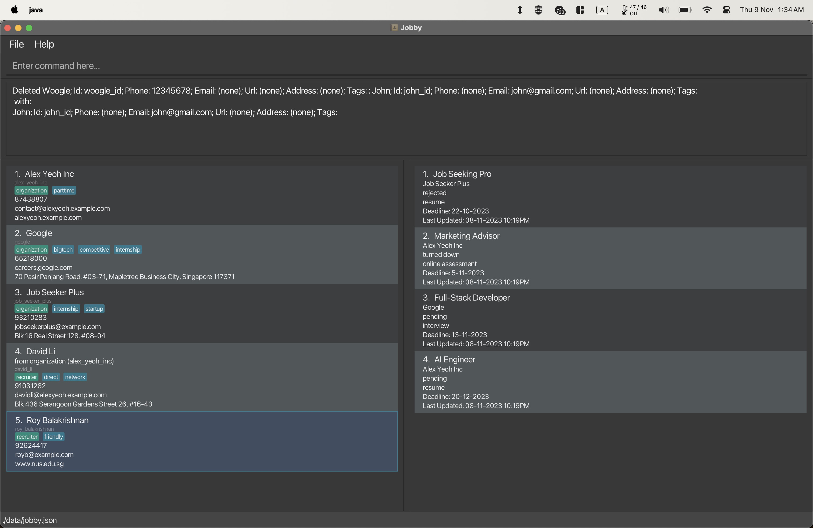

**Jobby** is a **desktop app for job seekers to manage job applications and networking contacts, optimized for use via a Command Line Interface (CLI)** while still having the benefits of a Graphical User Interface (GUI). Jobby can help you manage tracking your job applications and contacts in a more streamlined fashion. If you can type fast, Jobby can get your contact management tasks done faster than traditional GUI apps.

* Table of Contents
{:toc}

--------------------------------------------------------------------------------------------------------------------

## Installation

1. Ensure you have Java `11` or above installed in your Computer.

1. Download the latest `jobby.jar` from [here](https://github.com/AY2324S1-CS2103T-W08-3/tp/releases).

1. Copy the file to the folder you want to use as the _home folder_ for your Jobby Application.

1. Open a command terminal, `cd` into the folder you put the jar file in, and use the `java -jar jobby.jar` command to run the application.<br>
   A GUI similar to the below should appear in a few seconds. Note how the app contains some sample data.<br>
   

1. Type a command in the command box and press Enter to execute it - e.g., typing **`help`** and pressing Enter will open the help window.<br>

1. Refer to the [Features](#features) below for details of each command.

--------------------------------------------------------------------------------------------------------------------

## Starter Guide
Welcome to Jobby's documentation! This quick start guide will give you an introduction of 80% of Jobby's 
functionalities that you will use on a daily basis. 

This guide will be done in an example workflow that you will likely experience while using Jobby to get you accustomed to all of Jobby's commands.

> ### You will learn
> - How to add contact into Jobby
> - How to edit contact in Jobby
> - How to add application in Jobby
> - How to use core features like find, remove
> - How to delete data in Jobby
> - And more...

### GUI Legends

Below is a labelled diagram of our GUI




### Adding `Contact`
Jobby can create `Contacts`. In the form of `Organization` and `Recruiter`, which you can add into your database with simple CLI commands.

Let's say you want to track your job application for the `Organization: Woogle`, with a `Recruiter: John`.

You can add the `Organization` into Jobby with a simple command: 
```add --org --name Woogle --id woogle_id```




You can then add a **recruiter** that's related to the "Woogle" organization like so:: 
```add --rec --name John --id john_id --oid woogle_id```




> To find out all of `Organization` and `Recruiter`'s flags, go [organization documentation]()
> and [recruiter documentation]()

### Adding `Application`
Let's say now you want to apply to `Woogle` for the position of `Junior Software Engineer` role. You will be able to create
an `Application` for this company with the by including the `Organization ID` in the command: 
`apply woogle_id --title Software Engineer --by 22-11-2023`



`Application` will automatically generates the fields if there are no inputs on your end.
- `Status: Pending`
- `Stage: Resume`

> You will be able to add different details of `Application`, see the [applcation documentation]() here.

### Editing `Contact`
Now that you have both your Contacts and Applications. You received new informations about your `Contacts`, you will have to edit your `Contact` data.

We can do so with the `edit` CLI command with the desired id and input.

Let's say we want to change the phone detail of `Organization: Woogle` and email of `Recruiter: John`.
We can use the commands:
`edit woogle_id --phone 12345678` and `edit john_id --email john@gmail.com`




After executing the commands,
`Organization: Woogle`'s number changed to `phone: 12345678`.
`Recruiter: John`'s email changed to `Email: john@gmail.com`.

> To find more ways to `edit` `Organization` and `Recruiter`, see the [edit documentation](LINK TO ORGANIZATION AND RECRUITER DOCUMENTATION)

### Editing `Application`
For your `Woogle` application, you managed to pass the resume screening stage! And you will have to change your `Stage` to 
the `Interview` stage.

You will be able to do it simply with:
`edit --application 5 --stage interview`




This will change your `Stage` from `Resume` to `Interview`, indicating that you are onto the next stage of the application process.
> To find more more fields of the `Application` to edit, see the [edit documentation](LINK TO EDIT APPLICATION DOCUMENTATION)

### Get `Reminder`
During your internship application process, you might feel that there are many deadlines that you have to keep track of,
in Jobby, we have a `Remind` command that will help you sort your applications by their `Deadlines`.

You can do so with a simple command:
`remind --earliest` 
to see your application deadlines from the earliest to latest.


> To find out more ways to use `remind`, see the [remind documentation](LINK TO REMIND DOCUMENTATION).

### Finding `Organization` and its related `Applications
Let's say there is a specific organization application you are looking for, like **Woogle**, you will be able to easily find it via
this command: ```find woogle```

SCREENSHOT

> To find out more ways to use `find`, see the [find documentation](LINK TO find DOCUMENTATION).


### List everything back
After filtering, you want to get back the entire list of organizations and applications in Jobby. You can simply use
the `list` command.




### Deleting data
After you are done with your application, or if you realised that one of the `Contact` in Jobby no longer exists, you can
feel free to `delete` the `Organization` from Jobby.

In our case, let's delete `Woogle` from Jobby by executing the command:
`delete woogle_id --recursive`

This will delete `Woogle` along with all of its **applications** and **recruiters**. 




### Next Steps
By now, you should know the basics of how Jobby works!

Checkout [Understanding Jobby's command syntax](#Understanding-Jobby's-command-syntax).

--------------------------------------------------------------------------------------------------------------------

## Using Jobby

This section explains the details of how we can interact with Jobby.

If you're looking for the list of available commands, check out the [Features](#features) section instead.

### Command Structure

<span class="learning-outcome pill">:trophy: How to understand and write Jobby commands</span> <span class="beginner pill">Beginner</span>

In Jobby, we write commands in the command box at the top of Jobby's window.

Commands are made up of a few parts: The **command**, **parameter names** and **input values**.

A command like "`edit google --name Google SG --id google-sg`" would refer to:
* the **command** `edit`,
* with a **command value** `google`,
* with a **parameter** `--name`,
  * which has the **parameter value** `Google SG`,
* with a **parameter** `--id`,
  * which has the **parameter value** `google-sg`.

Parameters may be in any order, whose names are of the form `-a` or `--abc123`, and must be surrounded by whitespace.

Any extra parameters and values to commands that don't accept them will either be ignored or throw an error.

<div markdown="block" class="alert alert-info">

**:bulb: Additional information:**<br>

* Parameter names are restricted to the `-`/`--` prefix, contain only letters and numbers, and must begin with a letter.

* Any parameter names not following the required format will be treated as data input, so an input like *"-5 degrees"* will work.

* Although Jobby's syntax resembles the usual Unix syntax, you should not quote your text, and you should not leave a trailing `=`.

</div>

### Command Explanations

<span class="learning-outcome pill">:trophy: How to interpret this guide's command explanations</span> <span class="beginner pill">Beginner</span>

Throughout this guide, you will find symbols and placeholders used to describe a command format. They are:

* **Words in `UPPER_CASE`**

  * The parts where you should be typing your parameter values.

  * e.g., `--name NAME` means inputting names along the lines of `--name Alice`.

* **Terms separated by `/` or `|`**

  * Exactly one of the given options.

  * These may be included in the parameter names or value description.

  * e.g., `--a/--b` means either `--a` or `--b` but not `--a --b`.

* **Terms surrounded by `[` and `]`**

  * An optional parameter or option that may be omitted.

  * e.g., `[--id ID]` means you may omit setting an ID for the command.

* **Terms ending with `...`**

  * The parameter is multivalued.

  * e.g., `[--tag TAG]...` means `--tag` and its value can be repeated from 0 to any number of times.


### Command Autocomplete

<span class="learning-outcome pill">:trophy: How to use Jobby's command autocompletion</span> <span class="beginner pill">Beginner</span>

Command autocompletion allows you to type commands in Jobby at unimaginable speeds.

As you type your command, you may see a list of suggested completions pop up.
Just press **TAB** or **SPACE** to select the first suggestion to fill in that text!


To temporarily hide all suggestions, press **ESC**. This temporarily disables autocompletion for the next keystroke.

If suggestions were hidden or aren't shown when they should, press **TAB** to prompt Jobby to bring it back.

<div markdown="block" class="alert alert-info">

**:bulb: Additional tips:** <br>

* If you rather choose from the list instead of typing out the prefix, it is possible to use the **UP** and **DOWN**
  arrow keys to navigate through the menu, then press **ENTER** to select them.

* Accidentally triggered autocomplete when you didn't intend to? Don't worry, just press **BACKSPACE** to immediately
  revert to your previously typed text.

* <span class="expert pill">Expert</span> Autocomplete checks for fuzzy matches - it sorts by the best *subsequence* prefix match first.

  * For example, you can type `-nm` to get the autocompletion result of `--name`.

  * This allows you to quickly choose between parameter names with similar prefixes, e.g., by typing
    `-dsp` to select `--description` instead of `--descending`.

</div>

<div markdown="block" class="alert alert-warning">

**:warning: Limitations:**<br>

* Autocomplete is not autocorrect. It will not attempt to correct mistyped details.

* Autocomplete suggests plausible values you may want to add onto your partially typed command. It does not verify that the command will run.

</div>

-------------------------------------------------------------------------------------------------

## Features

#### Adding an organization contact: `add --org`

Format: `add --org --name NAME [--id ID] [--phone NUMBER] [--email EMAIL] [--url URL] [--address ADDRESS] [--tag TAG]... `

Acceptable Parameters:
* `NAME` can accept any value, but must not be blank.
* `ID` refers to a unique identifier which is used to uniquely identify the organization (alphanumeric and basic symbols, i.e. should only be `a-z`, `A-Z`, `0-9`, `-`, `_`).
    * Specifying this sets the ID, or one unique one will be derived and generated from the name if not provided.
* `NUMBER` should be a valid phone number.
* `EMAIL` should be a valid email.
* `URL` should be a valid url-like format.
* `ADDRESS` can accept any value. It designates the contact’s physical address.
* `TAG` can accept any value and may have multiple inputs.


Examples:
* `add --org --name J&J`
* `add --org --name Google --id g-sg --phone 98765432 `
* `add --org --name Hoyoverse --email mihoyo@example.com --tag example1 --tag example2`
* `add --org --name Example --url www.organization.org --tag freelance`
* `add --org --name Examinations NUS --phone 65166269 --email examinations@nus.edu.sg --url https://luminus.nus.edu.sg/`

### Editing a contact: `edit`

Current: Edit contacts whose names contain any of the given keywords or ids.

Format: `INDEX/ID [--name NAME] [--id ID] [--phone PHONE] [--email EMAIL] [--url URL] [--address ADDRESS] [--tag TAG]...`

* Names, index and id are being searched.
* For id, the search is case-insensitive, e.g. `hans` will match `Hans`
* For Index, the search will match with the index as listed on the GUI e.g. `1` will match with the first item in the GUI.
* You can change the parameter of any of the `[--variable NEW VALUE]`, e.g. `edit 1 --name Google --phone 91241412 --email google@gmail.sg`, which changes the name, phone number and email of the contact

Examples:
* `edit google --phone 91292951` changes the phone number of google to `91292951`
* `edit 1 --name Jane Street` changes the name of the contact at index 1 in the GUI to `Jane Street`
* `edit 1 --name Google --phone 91241412 --email google@gmail.sg`, which changes the name, phone number and email of the contact to `Google`, `91241412` and `google@gmail.sg` respectively.

### Locating contacts by name and id: `find`

Current: Finds contacts whose names contain any of the given keywords or ids.

Format: `find KEYWORD/ID...`

* Name & ID are searched
* The search is case-insensitive. e.g `hans` will match `Hans`
* The order of the keywords does not matter. e.g. `Hans Bo` will match `Bo Hans`
* You can match partial keywords. e.g. searching for `ha` will match with `hamburger`.
* Partial IDs can match the entire ID. e.g. searching for `1234` will match with `id_12345`.
* Persons matching at least one keyword will be returned (i.e. `OR` search)
  e.g. `Hans Bo` will return `Hans Gruber`, `Bo Yang`
* Can match with multiple ids `12345 id_51231` will match with `id_12345` and `id_51231`

Examples:
* `find John` returns `john` and `John Doe`
* `find id_12345` returns `john` and whose id is `id_12345`
* `find Jo` returns `john`, `John Doe`, `Josh` and every other keyword with `jo` in its substring
* `find alex david` returns `Alex Yeoh`, `David Li`

### Add command - `add`

Applies to: <span class="jobby-data-class">Organization</span> <span class="jobby-data-class">Recruiter</span>

<span class="learning-outcome pill">:trophy: How to add contacts into Jobby</span> <span class="beginner pill">Beginner</span>

Format: `add --org/--rec <additional parameters and values...>`

Adds a contact to the address book of the given class type: <span class="jobby-data-class">Organization</span> or <span class="jobby-data-class">Recruiter</span>.

Supplying `--org` adds an <span class="jobby-data-class">Organization</span> while supplying `--rec` adds a <span class="jobby-data-class">Recruiter</span> to the address book.

Details on adding an [organization]() contact and a [recruiter](#add-recruiter-command---add---rec) contact are specified in the next sections

#### Add recruiter command - `add --rec`

Applies to: <span class="jobby-data-class">Recruiter</span>

<span class="learning-outcome pill">:trophy: How to add recruiter contacts into Jobby</span> <span class="beginner pill">Beginner</span>

<span class="information pill">:information_source: Assumes that you have completed the tutorial</span> <br>

Format: `add --rec --name NAME [-id ID] [--oid ORG_ID] [--phone NUMBER] [--email EMAIL] [--url URL] [--address ADDRESS] [--tag TAG]...`

Required Fields:
* `NAME` - The name of the <span class="jobby-data-class">Recruiter</span>. A valid name can be of any value, but must not be blank.

Optional Fields:
* `ID` - The unique identifier of the <span class="jobby-data-class">Recruiter</span>. A valid `ID` must start with a letter and can consist of alphanumeric and basic symbols, i.e. should only be `a-z`, `A-Z`, `0-9`, `-`, `_`.
    * Specifying this sets the `ID`, or a unique one will be derived and generated from the `NAME` if not provided. <br>

* `ORG_ID` - The unique identifier of the <span class="jobby-data-class">Organization</span> linked to this <span class="jobby-data-class">Recruiter</span>. It is subjected to the same validation as the `ID` field. The value provided must be the `ID` of an existing <span class="jobby-data-class">Organization</span> in the address book.

* `NUMBER` - The phone number of the <span class="jobby-data-class">Recruiter</span>. A valid phone number contains only numbers and must be at least 3 digits long. E.g. 999 or 87263614

* `EMAIL` - The email of the <span class="jobby-data-class">Recruiter</span>. A valid email consists of a _local-part_ and _domain_ and should be in the form of *local-part@domain*. E.g. johndoe@example.com

* `URL` - The url of the <span class="jobby-data-class">Recruiter</span>. A valid url should be a path that contains _domain.tld_. E.g. example.com, subdomain.example.com/path, https://example.com

* `ADDRESS` - The address of the <span class="jobby-data-class">Recruiter</span>. A valid address can be any non-empty value. It designates the <text class="jobby-data-class">Recruiter's</text> physical address.

* `TAG` - The tag(s) of the <span class="jobby-data-class">Recruiter</span>. A valid tag consists of only alphanumeric characters. Multiple tags can also be specified.

Examples of valid use of `add --rec` command:
* `add --rec --name John Doe` _Adds a recruiter that is not linked to any organization._
* `add --rec --name John Doe --tag friendly --tag woogle` _Adds a recruiter with two tags - friendly and woogle._
* `add --rec --name John Doe --oid paypal-sg` _Adds a recruiter that is linked to an organization (if it exists in the address book) with the id "paypal-sg"_

Examples of invalid use of `add --rec` command:
* `add --rec` _Missing a name._
* `add --rec --name John Doe --phone` _Optional fields (in this case `--phone`) were used but not specified_
* `add --rec --name John Doe --oid bogus-org` _Given that no organization with the id "bogus-org" exists in the address book._

Sample demonstration with the expected visual outcome:
* If you execute the command: `add --rec --name Ryan Koh --oid job_seeker_plus`, you should see a new contact being added to the list of contacts on the left panel.

* Since the `--oid` flag was provided, the newly added recruiter contact will have a special label _from organization (job\_seeker\_plus)_ to indicate that the recruiter is linked to the organization with that particular id.


#### List contacts - `list`
<span class="learning-outcome">:trophy: Able to list contacts, organizations, and recruiters in Jobby</span>

<span class="information">:information_source: Assumes that you have completed the tutorial</span>

Format: `list [--org/--rec]`

Shows a list of all contacts in the address book.
Supplying `--org` lists only Organizations while supplying `--rec` lists only Recruiters.

Examples:
* `list`
* `list --org`
* `list --rec`

[SCREENSHOT HERE]

#### Sorting contacts and job applications - `sort`
<span class="learning-outcome">:trophy: Able to sort contacts and job applications in Jobby</span>

<span class="information">:information_source: Assumes that you have completed the tutorial</span>

Format: `sort --FLAG_TO_SORT [--ascending/--descending]`


Supported flags (only 1 must be provided): [This should be a title font, I think]

Flags for contacts:
* `--address` - The address of the <span class="job-application">Contact</span>. Will sort alphabetically.
* `--email` - The email address of the <span class="job-application">Contact</span>. Will sort alphabetically.
* `--id` - The identification string of the <span class="job-application">Contact</span>. Will sort alphabetically.
* `--name` - The name of the <span class="job-application">Contact</span>. Will sort alphabetically.
* `--phone` - The phone number of the <span class="job-application">Contact</span>. Will sort alphabetically.
* `--url` - The web address of the <span class="job-application">Contact</span>. Will sort alphabetically.

Flags for job applications:
* `--by` - The deadline of the <span class="job-application">Job Application</span>. Will sort chronologically.
* `--stage` - The stage of the <span class="job-application">Job Application</span>. Will sort by stage order.
* `--stale` - The time of last update of the <span class="job-application">Job Application</span>. Will sort chronologically.
* `--status` - The status of the <span class="job-application">Job Application</span>. Will sort by status order.
* `--title` - The title of the <span class="job-application">Job Application</span>. Will sort alphabetically.

Flags for resetting the sort order:
* `--none` - Will reset the sorting order of <span class="job-application">Contacts</span> and <span class="job-application">Job Applications</span>.

Flags for specifying the sort order:
* `--ascending` - The specified flag will sort in ascending order.
* `--descending` - The specified flag will sort in descending order.

If neither `--ascending` or `--descending` are provided, the list will be sorted in ascending order by default.

Neither `--ascending` nor `--descending` may be specified if the flag is `--none`.

`Sort` will work even if no <span class="job-application">Contacts</span> or <span class="job-application">Job Applications</span> exist.

[SCREENSHOT HERE]

Examples of valid use of `sort` command:
* `sort --title --ascending`
* `sort --url`
* `sort --stale --descending`
* `sort --none`

Examples of invalid use of `sort` command:
* `sort` _No flag provided._
* `sort --organization` _Invalid flag._
* `sort --none --ascending` _Flags `--none` and `--ascending` both specified._


### Reminding about deadlines: `remind`
Reminds the user of upcoming deadlines for job applications.

Format: `remind --earliest/--latest`

Specifying `--earliest` will list the application deadlines in order of urgency, from earliest to latest.

Specifying `--latest` will list the application deadlines in order of reverse urgency, from latest to earliest.

Examples:
* `remind --earliest`
* `remind --latest`

### Apply command - `apply`
Applies to: <span class="jobby-data-class">Job Application</span>

<span class="learning-outcome">:trophy: Able to add detailed job applications associated with an organization in Jobby</span> <span class="intermediate pill">Intermediate</span>

<span class="information">:information_source: Assumes that you have completed the tutorial</span>

Format: `apply INDEX/ID --title TITLE [--description DESCRIPTION] [--by DEADLINE: DD-MM-YYYY] [--stage APPLICATION STAGE: resume | online assessment | interview] [--status STATUS: pending | offered | accepted | turned down]`

Required fields:
* `INDEX/ID` - The index or the id of the <span class="jobby-data-class">Organization</span>
  in the list to be applied to. Must be a valid and existing index or id.
* `TITLE` - The job title of the position. Accepts multiple words separated with spaces, as long as characters are alphanumeric. 
  * You cannot add an application to an <span class="jobby-data-class">Organization</span> if that <span class="jobby-data-class">Organization</span> already has a job application with the same job title (case-sensitive).

Optional fields:
* `DESCRIPTION` - The description of the <span class="jobby-data-class">Job Application</span>. If specified, it should not be empty.
* `DEADLINE` - The deadline of the current stage of the <span class="jobby-data-class">Job Application</span>. If specified, it should be in the format **DD-MM-YYYY**. If not specified, it is set to 14 days from the current date.
  * The deadline can be set to before the current date. This is an intended feature.
* `APPLICATION STAGE` - The stage of the <span class="jobby-data-class">Job Application</span>. If specified, it must be one of the 3 options: **resume, online assessment, interview**. If not specified, it is set to **resume**.
* `STATUS` - The status of the <span class="jobby-data-class">Job Application</span>. If specified, it must be one of the 4 options: **pending, offered, accepted, turned down**. If not specified, it is set to **pending**.

Examples of valid use of `apply` command:
* `apply 1 --title SWE` _Given that the first item in the list of contacts is an organization._
* `apply id_12345_1 --title Unit Tester --by 12-12-2023` _Given that id_12345_1 is an id belonging to an organization._
* `apply id_12345_1 --title Level 7 Engineer --description Senior role, Pay: $100 --by 12-12-2023 --stage resume --status pending`

Examples of invalid use of `apply` command:
* `apply 0 --title SWE` _Invalid index._
* `apply 10 --title SWE` _Given that there are only 9 contacts in the list and the 10th contact does not exist._
* `apply 1 --title SWE` _Given that the first contact is a recruiter and not an organization._
* `apply 1` _Job title not specified._
* `apply 1 --title SWE --description` _Optional fields were used but not specified._
* `apply 1 --title SWE --by 31-31-2023` _Invalid date for deadline._
* `apply 1 --title SWE --by tomorrow` _Invalid format for deadline._


### Edit command - `edit`

Applies to: <span class="jobby-data-class">Job Application</span> <span class="jobby-data-class">Organization</span> <span class="jobby-data-class">Recruiter</span>

<span class="information">:information_source: Assumes that you have completed the tutorial</span> <span class="intermediate pill">Intermediate</span>

<span class="warning-bubble">:warning: Any edits made are not reversible.</span>

#### Edit application command - `edit --application`
<span class="learning-outcome">:trophy: Able to edit job applications associated with an organization in Jobby</span>

<span class="information">:information_source: Also assumes that you have read the `apply` command documentation.</span>

Format: `edit --application INDEX [--title TITLE] [--description DESCRIPTION] [--by DEADLINE] [--status STATUS] [--stage STAGE]`


Required fields:
* `INDEX` - The index of the <span class="jobby-data-class">Job Application</span> to edit in the list.

Optional fields (at least 1 must be provided):
* `TITLE` - The new job title of the <span class="jobby-data-class">Job Application</span>.
  * The title cannot match a title of another <span class="jobby-data-class">Job Application</span> belonging to the same <span class="jobby-data-class">Organization</span> that is being applied to.
* `DESCRIPTION` - The new description of the <span class="jobby-data-class">Job Application</span>.
* `DEADLINE` - The new deadline of the <span class="jobby-data-class">Job Application</span>.
* `STATUS` - The new application status of the <span class="jobby-data-class">Job Application</span>.
* `STAGE` - The new job application stage of the <span class="jobby-data-class">Job Application</span>.

Examples of valid use of `edit --application` command:
* `edit --application 1 --title SRE` _Given that there is at least 1 job application._
* `edit --application 1 --status pending` _Given that there is at least 1 job application._

Examples of invalid use of `edit --application` command:
* `edit --application 0 --title SRE` _Invalid index._
* `edit --application 1` _One of the fields to edit are not given._
* `edit --application 1 --title SWE` _Given that the organization of the application being updated already has another application with the title "SWE"._
* `edit --application 1 --by 31-31-2023` _Invalid date._


### Delete command - `delete`

Applies to: <span class="jobby-data-class">Job Application</span> <span class="jobby-data-class">Organization</span> <span class="jobby-data-class">Recruiter</span>

<span class="information">:information_source: Assumes that you have completed the tutorial</span>

<span class="alert-bubble">:warning: The deletion of data is permanent and there is no way to undo it.</span>

#### Delete contact command - `delete`

<span class="learning-outcome">:trophy: Able to delete contacts in Jobby, and in particular deleting organizations and its associated recruiters and job applications from Jobby</span> <span class="intermediate pill">Intermediate</span>

Format: `delete INDEX/ID [--recursive]`

If the contact to delete is an organization, it will delete the job applications associated with it.

Required fields:
* `INDEX/ID` - The index or the id of the <span class="jobby-data-class">Contact</span> in the list

Optional fields:
* `--recursive` - Deletes the associated recruiter contacts if the contact to delete is an organization.

Examples of valid use of `delete` command
* `delete 1` _Given that there is at least 1 contact in the list._
* `delete 1 --recursive` _Given that there is at least 1 contact in the list._

Examples of invalid use of `delete` command
* `delete 0` _Invalid index._

#### Delete job application command - `delete --application`

<span class="learning-outcome">:trophy: Able to delete job applications in Jobby</span> <span class="intermediate pill">Intermediate</span>

Format: `delete --application INDEX`

Required fields:
* `INDEX` - The index of the <span class="jobby-data-class">Job Application</span> in the list.

Examples of valid use of `delete` command
* `delete --application 1` _Given that there is at least one job application in the list._

Examples of invalid use of `delete` command
* `delete --application 0` _Invalid index._


--------------------------------------------------------------------------------------------------------------------

## Glossary

(Terms that may be difficult to understand here.)

--------------------------------------------------------------------------------------------------------------------

## Issues

(Where to report issues and what bugs currently exist)

