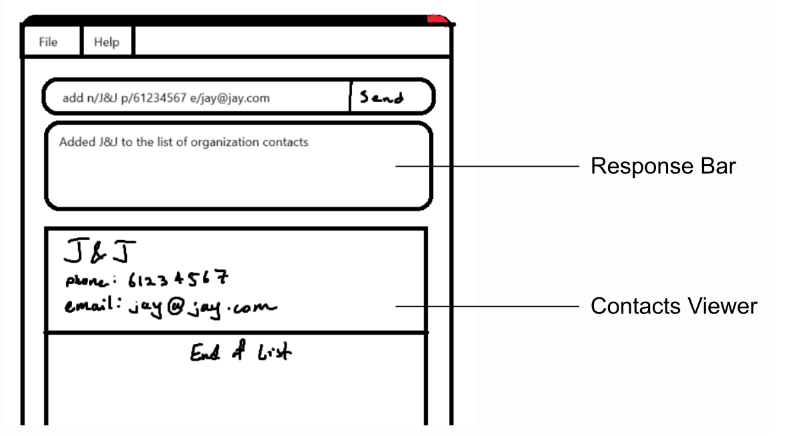
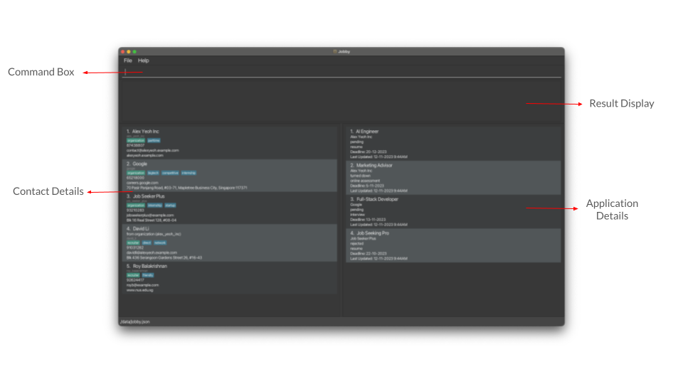
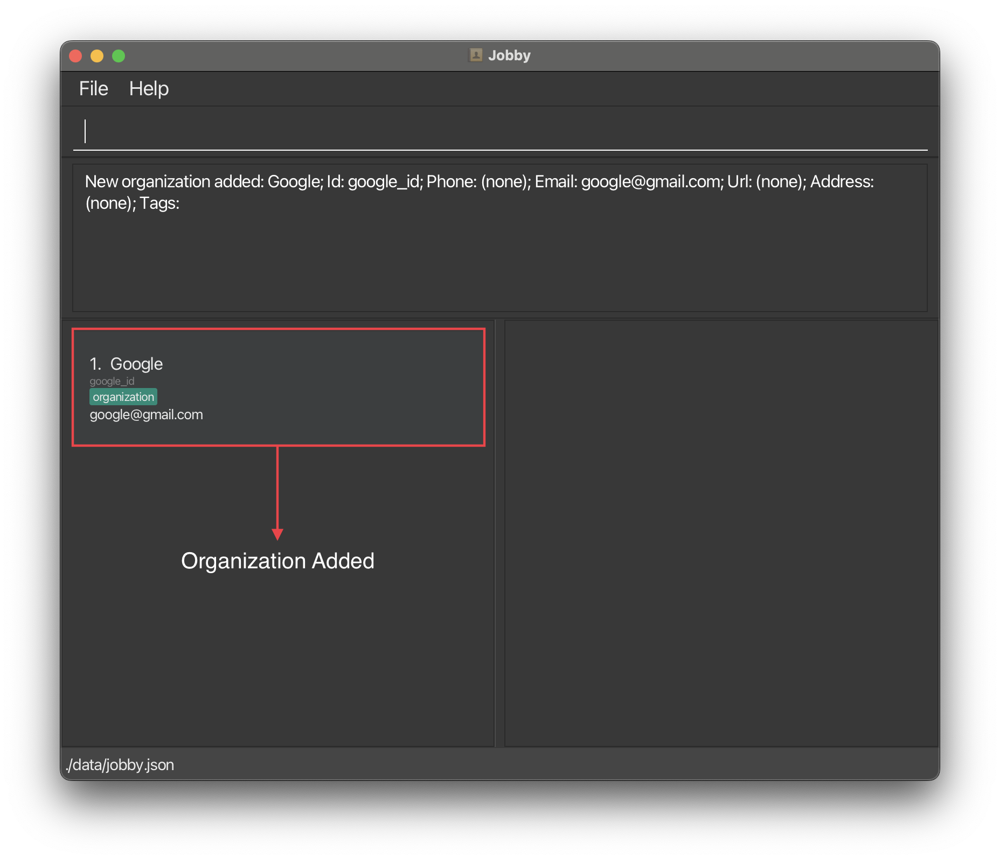
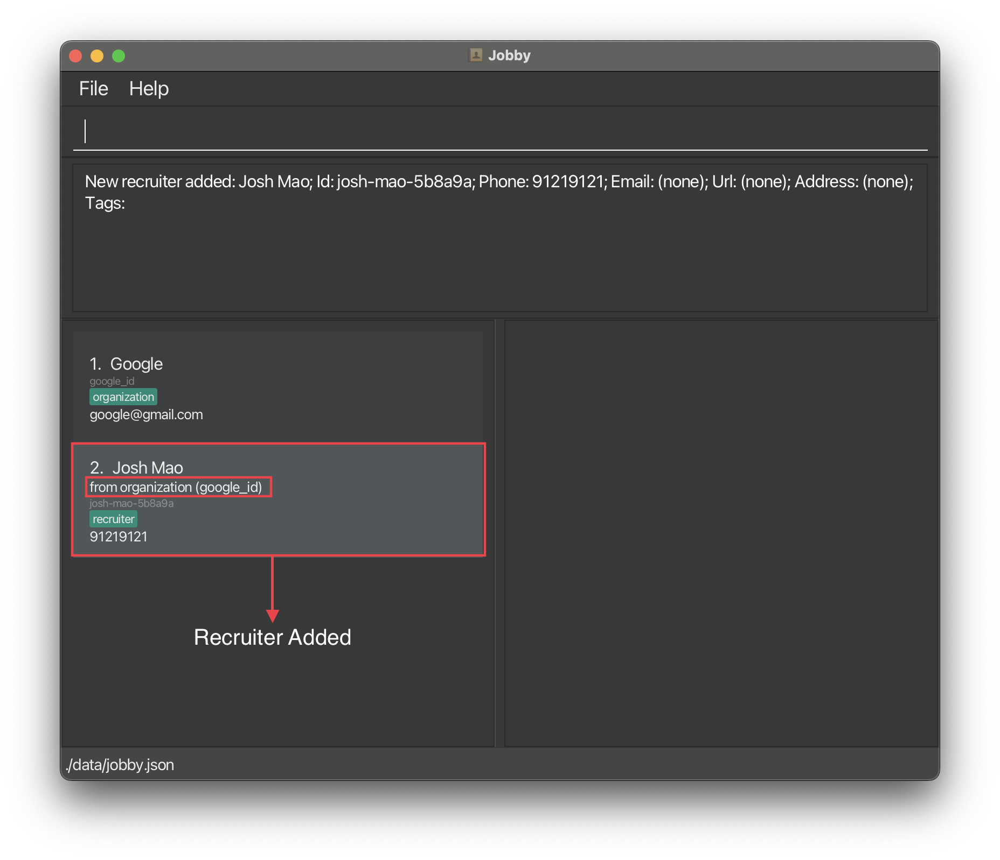
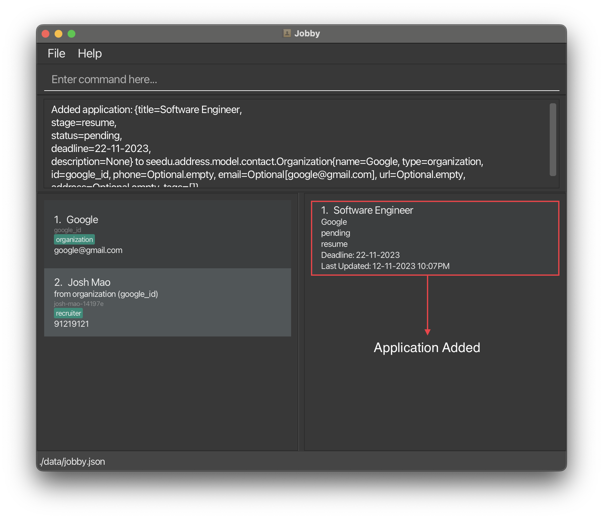
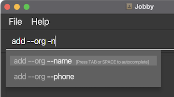
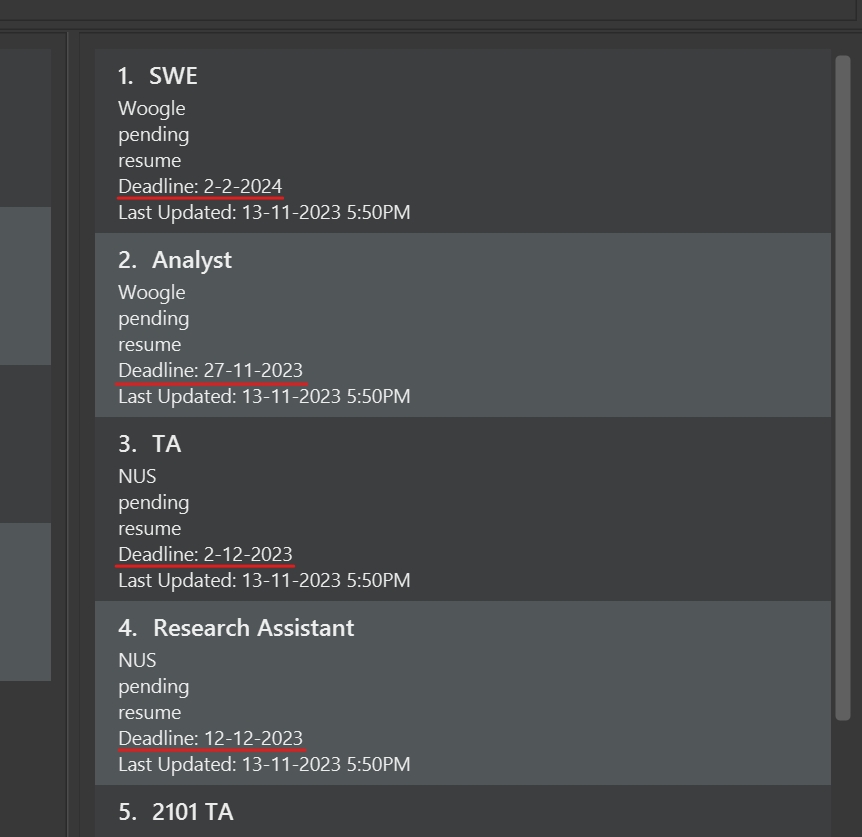
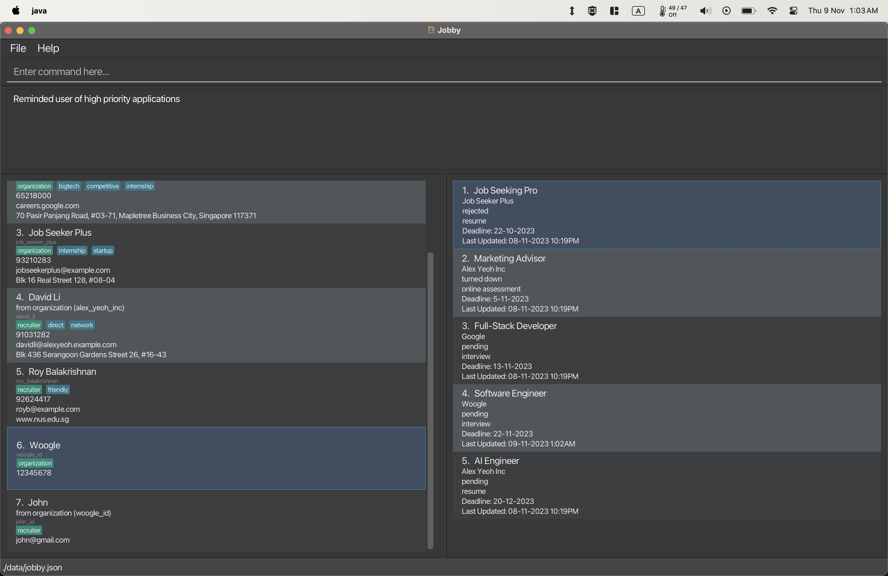

## Introduction

<div class="reset-page-break-defaults" markdown="1">

  Welcome to the **Jobby** User Guide!

  **Jobby** is a **desktop app designed for Computer Science students looking for a systematic way to manage their job applications and networking contacts, optimized for use via a Command Line Interface (CLI)** while still having the benefits of a Graphical User Interface (GUI). Jobby can help you manage tracking your job applications and contacts in a more streamlined fashion. If you can type fast, Jobby can get your contact management tasks done faster than traditional GUI apps.

  It is assumed that you know how the job application process is like, and that you know how to look for job applications.

### Purpose of this guide

  The purpose of this guide is to get you familiar with the features of **Jobby** - from the very basics, to the most advanced features the application has to offer. These features range from the simple task of adding contacts into the application for tracking to how our application can assist you in tracking every step of your application process. We will go through every feature **Jobby** has to offer within this guide. You can check out the Table of Contents to navigate to a feature you might be interested in using.

### How to use this guide

  _(For users who just want to see the table of contents, click [here](#table-of-contents).)_  

  To begin using this guide, ensure you have [installed Jobby](#installation). 
  Once this is done, go to the [tutorial](#jobby-tutorial-for-new-users) section to get started on the basic features of Jobby. 
  
  When you become more familiar with the basic features, you can move on to understand [how Jobby's commands are structured and how to use autocomplete to your advantage](#using-jobby). 
  
  Afterwards, please feel free to go through the [features section](#features) to find out what features Jobby has installed. We recommend going through it in the order of this guide but any order works as well! You may check out our table of contents to jump to any section of your choice.

  _The different symbols and formats used are explained in [this section](#navigating-the-guide)._

  _The summary of the commands can be found [here](#command-summary)._

</div>

--------------------------------------------------------------------------------------------------------------------

## Table of contents
<div class="reset-page-break-defaults" markdown="1">
* Table of Contents
{:toc}
</div>

## Installation

1. Ensure you have _Java 11_ or above installed in your computer.
   * Download Java [here](https://www.oracle.com/java/technologies/downloads/)
   * How to check your Java version on [Windows](https://www.howtogeek.com/717330/how-to-check-your-java-version-on-windows-10/), [macOS](https://www.wikihow.com/Check-Java-Version-on-a-Mac), and [Linux](https://stackoverflow.com/questions/47627270/how-to-check-java-version-at-linux-redhat6). 

1. Download the latest _jobby.jar_ from [here](https://github.com/AY2324S1-CS2103T-W08-3/tp/releases).

1. Copy the file to the folder you want to use as the _home folder_ for your Jobby Application.

1. Open a command terminal, navigate into the folder you put the jar file in, and enter `java -jar jobby.jar` in the terminal to run the application.<br>
   A window similar to the below should appear in a few seconds. Notice that the app contains some sample data.<br>
   * If you do not know how to navigate to your folder in the terminal, check out these links for [Windows](https://www.howtogeek.com/659411/how-to-change-directories-in-command-prompt-on-windows-10/), [macOS](https://appletoolbox.com/navigate-folders-using-the-mac-terminal/), and [Linux](https://askubuntu.com/questions/232442/how-do-i-navigate-between-directories-in-terminal).
  

1. Type a command in the command box and press Enter to execute it - e.g., typing `help` and pressing Enter will open the help window.<br>

1. Refer to the [Features](#features) below for details of each command.

--------------------------------------------------------------------------------------------------------------------


## Navigating the Guide

<div class="reset-page-break-defaults" markdown="1">

### Code blocks for entering commands

<code> </code> &nbsp; denotes a command or a part of a command that can be entered in Jobby. For example, `add --org --name Woogle`{:.language-sh} is a command. `add` is also part of a command.

### Small information pills

| <span style="width: 200px; display: inline-block;"> Component </span>                                                                                                         | Description                                                                                                                                                                                                                                                                                                           |
|-------------------------------------------------------------------------------------------------------------------------------------------------------------------------------|-----------------------------------------------------------------------------------------------------------------------------------------------------------------------------------------------------------------------------------------------------------------------------------------------------------------------|
| <span class="learning-outcome pill">:trophy: Learning outcomes</span>                                                                                                         | The learning outcome of the section.                                                                                                                                                                                                                                                                                  |
| <span class="beginner pill">Beginner</span><br><span class="intermediate pill">Intermediate</span><br><span class="expert pill">Expert</span>                                 | The difficulty level of the section, with <span class="beginner pill">Beginner</span> for new users, <span class="intermediate pill">Intermediate</span> for users who have completed the tutorial, and <span class="expert pill">Expert</span> for users who have completed and used the features in the User Guide. |
| <span class="information pill">:information_source: An info pill</span>                                                                                                       | Contains some additional information, such as assumptions and useful information.                                                                                                                                                                                                                                     |
| <span class="warning pill">:warning: Some warning</span>                                                                                                                      | Contains a short warning regarding the use of a feature.                                                                                                                                                                                                                                                              |
| <span class="danger pill">:warning: A danger pill</span>                                                                                                                      | Contains a short danger message regarding the use of a feature.                                                                                                                                                                                                                                                       |
| <span class="jobby-data-class pill">Organization</span><br><span class="jobby-data-class pill">Recruiter</span><br><span class="jobby-data-class pill">Job Application</span> | The different objects of interest in Jobby: Organizations, Recruiters and Job Applications.                                                                                                                                                                                                                           |
| <span class="applies-to pill"><span class="jobby-data-class pill">Organization</span></span>                                                                                  | Contains information on which objects of interest in Jobby the feature can be used on.                                                                                                                                                                                                                                |

### Large information sections

<div markdown="block" class="alert alert-info">
:bulb: This is a blue box. It can be used for additional tips or more useful information.
</div>

<div markdown="block" class="alert alert-warning">
:warning: This is a warning box. It can be used to give more details on the warnings and limitations of features.
</div>

</div>

--------------------------------------------------------------------------------------------------------------------
## Navigating the Interface

Jobby comes equipped with a user interface that provides visual feedback to you. Below is a quick overview of the various components of our interface.



| Component           | Description                                                                                                |
|---------------------|------------------------------------------------------------------------------------------------------------|
| Command Box         | You will enter your commands along with its input here.                                       |
| Result Display      | Displays the results of your commands.<br/>Any error messages will also be displayed here.                 |
| Contact Details     | Contains information related to the [contact](#glossary) like name, phone number, email etc.               |
| Application Details | Contains information related to the internship application details like status, deadline etc. |


--------------------------------------------------------------------------------------------------------------------
## Jobby Tutorial (for new users)

<div class="reset-page-break-defaults" markdown="1">


Hello and welcome to Jobby! We are delighted that you've chosen our platform to track your internship application process!

Before we begin, please ensure that you have viewed the following sections of the guide:
* [Installation](#installation) to help you get Jobby up and running.
* [Navigating the Interface](#navigating-the-interface) to get you familiarised with Jobby's User Interface.

Following this tutorial will guide you through the basic workflow and functionalities of Jobby. 
Here, you will learn how to add your first **Organization**, **Recruiter** and **Application**!

Click on any of the hyperlinks below to jump to respective sections of the guide!
* [The Beginning](#the-beginning)
* [Adding your first Organization](#adding-your-first-organization)
* [Adding your first Recruiter](#adding-your-first-recruiter)
* [Adding your first Application](#adding-your-first-application)

### The Beginning

When you first launch Jobby, you will notice that it comes preloaded with sample data for you to play with. You may use 
the sample data to familiarise yourself with the various features that Jobby provides straightaway!

If you wish to continue following our guide to learn the basic operations of Jobby, you can easily remove the sample data by:
1. Type `clear` into the command box
2. press **ENTER**

Solid! Now it's time to get started with Jobby!

</div>

### Adding your first Organization

Let's say you are interested to apply to **Google** as your internship destination, and you found their email **google@gmail.com**. 
(This is not their real email, of course)

You can use [`add --org`{:.language-sh}](#adding-organizations---add---org) to add the Google organization in Jobby:
1. Type `add --org --name Google --id google_id --email google@gmail.com`{:.language-sh} into the command box
2. Press **ENTER**



You have successfully added **Google**, with the email **google@gmail.com** into your **organization contact**!

### Adding your first Recruiter

In a job fair, you managed to meet a **Google** internship recruiter, **Josh Mao**, and he provided you with his number
**91219121**.

Here is how you can use [`add --rec`{:.language-sh}](#adding-recruiters---add---rec) to record the recruiter in Jobby:
1. Type `add --rec --name Josh Mao --oid google_id --phone 91219121`{:.language-sh} into the command box
2. Press **ENTER**



You have successfully added **Josh Mao** - a **recruiter** from Google with the phone number **91219121**.

### Adding your first Application

After preparing your resume, you are ready to apply to **Google** as an intern for their **Software Engineer** role! And you know that the application deadline is on the **22-11-2023**.

Here is how you can use [`apply`](#applying-to-organizations---apply) to track your application in Jobby:
1. Type `apply google_id --title Software Engineer --by 22-11-2023`{:.language-sh} into the command box
2. Press **ENTER**



You have successfully added your job application to **Google**!

**Congratulations!** You have run through the basics of Jobby. We hope that this tutorial has given you an understanding of a basic workflow in Jobby.
However, there are still many features that we have yet to introduce. Please refer to the [Using Jobby](#using-jobby) section to understand how to interpret
command structures and formats, or visit the [Features](#features) section to see the full capabilities of Jobby!

--------------------------------------------------------------------------------------------------------------------

## Using Jobby

This section explains how we can understand and interact with Jobby via commands.

If you're looking for the list of available commands, check out the [Features](#features) section instead.

### Understanding the Command Structure

<span class="learning-outcome pill">:trophy: How to understand and write Jobby commands</span> <span class="beginner pill">Beginner</span>

In Jobby, we write commands in the command box at the top of Jobby's window.

Commands are made up of a few parts: The **command**, **parameter names** and **input values**.

A command like "`edit google --name Google SG --id google-sg`{:.language-sh}" would refer to:
* the **command** `edit`,
* with a **command value** `google`,
* with a **parameter** `--name`{:.language-sh},
  * which has the **parameter value** `Google SG`,
* with a **parameter** `--id`{:.language-sh},
  * which has the **parameter value** `google-sg`.

Parameters may be in any order, whose names are of the form `-a` or `--abc123`{:.language-sh}, and must be surrounded by whitespace.

Any extra parameters and values to commands that don't accept them will either be ignored or throw an error.

<div markdown="block" class="alert alert-info">

**:bulb: Additional information:**<br>

* Parameter names are restricted to the `-`/`--` prefix, contain only letters and numbers, and must begin with a letter.

* Any parameter names not following the required format will be treated as data input, so an input like *"-5 degrees"* will work.

* <span class="expert pill">Expert</span> Although Jobby's syntax resembles the usual Unix syntax, you should not quote your text, and you should not leave a trailing `=`.

</div>

### Reading Command Formats

<span class="learning-outcome pill">:trophy: How to interpret Jobby-formatted command explanations</span> <span class="beginner pill">Beginner</span>

Throughout this guide and within Jobby itself, you will find symbols and placeholders used to describe a command format. They are:

* **Words in `UPPER_CASE`**

  * The parts where you should be typing your parameter values.

  * e.g., `--name NAME`{:.language-sh} means inputting names along the lines of `--name Alice`{:.language-sh}.

* **Terms separated by `/` or `|`**

  * Exactly one of the given options.

  * These may be included in the parameter names or value description.

  * e.g., `--a / --b`{:.language-sh} means either `--a`{:.language-sh} or `--b`{:.language-sh} but not `--a --b`{:.language-sh}.

* **Terms surrounded by `[` and `]`**

  * An optional parameter or option that may be omitted.

  * e.g., `[--id ID]`{:.language-sh} means you may omit setting an ID for the command.

* **Terms ending with `...`**

  * The parameter is multivalued.

  * e.g., `[--tag TAG]...`{:.language-sh} means `--tag`{:.language-sh} and its value can be repeated from 0 to any number of times.

* **Terms surrounded by `<` and `>`**

  * A high level description of the parameter or option.

  * e.g., if you see something like `< add some text here >`, it means you should replace it with your own text.

Parameters may have certain value format restrictions - Jobby will let you know if you do not meet a requirement when you input your command. Optionally, you may also refer to their details in [Appendix A](#appendix-a--acceptable-values-for-parameters) later.


### Autocompleting Commands

<span class="learning-outcome pill">:trophy: How to use Jobby's command autocompletion</span> <span class="beginner pill">Beginner</span>

Command autocompletion allows you to type commands in Jobby at unimaginable speeds.

As you type your command, you may see a list of suggested completions pop up.
Just press **TAB** or **SPACE** to select the first suggestion to fill in that text!



To temporarily hide all suggestions, press **ESC**. This temporarily disables autocompletion for the next keystroke.

If suggestions were hidden or aren't shown when they should, press **TAB** to prompt Jobby to bring it back.

<div markdown="block" class="alert alert-info">

**:bulb: Additional tips:** <br>

* If you rather choose from the list instead of typing out the prefix, it is possible to use the **UP** and **DOWN**
  arrow keys to navigate through the menu, then press **ENTER** to select them.

* Accidentally triggered autocomplete when you didn't intend to? Don't worry, just press **BACKSPACE** to immediately
  revert to your previously typed text.

* <span class="expert pill">Expert</span> Autocomplete checks for fuzzy matches - it sorts by the best *subsequence* prefix match first.

  * For example, you can type `-nm` to get the autocompletion result of `--name`{:.language-sh}.

  * This allows you to quickly choose between parameter names with similar prefixes, e.g., by typing
    `-dsp` to select `--description`{:.language-sh} instead of `--descending`{:.language-sh}.

</div>

<div markdown="block" class="alert alert-warning">

**:warning: Limitations:**<br>

* Autocomplete is not autocorrect. It will not attempt to correct mistyped details.

* Autocomplete suggests plausible values you may want to add onto your partially typed command. It does not verify that the command will run.

</div>

-------------------------------------------------------------------------------------------------

## Features

### Adding contacts - `add`
<div class="applies-to pill"><span class="jobby-data-class pill">Organization</span> <span class="jobby-data-class pill">Recruiter</span></div><br>

The `add` command allows you to create contacts to track details about the organizations and recruiters related to your job application process. To learn more about creating each type of contact, check out the sections below.

#### Adding organizations - `add --org`{:.language-sh}

<span class="learning-outcome pill">:trophy: How to add organization contacts into Jobby</span> <span class="beginner pill">Beginner</span>

##### Format
```sh
add --org --name NAME [--id ID] [--phone NUMBER] [--email EMAIL] [--url URL] [--address ADDRESS] [--tag TAG]...
```
Adds an organization contact with the details given to the command.

* If an `ID` is not specified, one will be automatically generated.
* If you wish to know more about the requirements for each parameter, check out the [given appendix](#appendix-a-acceptable-values-for-parameters).

##### Valid examples

| Command                                                                                                                | Reason                                                       |
|------------------------------------------------------------------------------------------------------------------------|--------------------------------------------------------------|
| `add --org --name J&J`{:.language-sh}                                                                                                 | Adding an organization **J&J**.                              |
| `add --org --name Google --id g-sg --phone 98765432 `{:.language-sh}                                                                  | Adding an organization **Google** with other flags.          |
| `add --org --name Examinations NUS --phone 65166269 --email examinations@nus.edu.sg --url https://luminus.nus.edu.sg/`{:.language-sh} | Adding an organization **Examination NUS** with other flags. |


##### Invalid examples

| Command                                               | Reason                                                                                                                             |
|-------------------------------------------------------|------------------------------------------------------------------------------------------------------------------------------------|
| `add --org --name`{:.language-sh}                                    | `--name`{:.language-sh} field used but not specified.                                                                                             |
| `add --org --name Google --phone 1231*&&@`{:.language-sh}            | Optional field (in this case `--phone`{:.language-sh}) was not following the [accepted parameters](#appendix-a-acceptable-values-for-parameters). |


#### Adding recruiters - `add --rec`{:.language-sh}

<span class="learning-outcome pill">:trophy: How to add recruiter contacts into Jobby</span> <span class="beginner pill">Beginner</span>

##### Format
```sh
add --rec --name NAME [-id ID] [--oid ORG_ID] [--phone NUMBER] [--email EMAIL] [--url URL] [--address ADDRESS] [--tag TAG]...
```
Adds a recruiter contact with the details given to the command.

* If an `ID` is not specified, one will be automatically generated.
* To link a <span class="jobby-data-class">Recruiter</span> to an <span class="jobby-data-class">Organization</span> in the contacts list, make sure you include `--oid`{:.language-sh} and pass in the `ID` of the <span class="jobby-data-class">Organization</span> you want to link to.
* If you wish to know more about the requirements for each parameter, check out the [given appendix](#appendix-a-acceptable-values-for-parameters).

##### Sample demonstration
* If you execute the command: `add --rec --name Ryan Koh --oid job_seeker_plus`{:.language-sh}, you should see a new <span class="jobby-data-class">Recruiter</span> being added to the bottom of the contacts list.

* The newly added contact will have a special label _from organization (job\_seeker\_plus)_ to indicate that the <span class="jobby-data-class">Recruiter</span> is associated to the <span class="jobby-data-class">Organization</span> with that particular `ID`.

<div style="text-align: center;">

</div>

##### Valid examples

| Command | Reason |
|-------|----------|
| `add --rec --name John Doe`{:.language-sh} | Adds a recruiter that is not associated to any organization. |
| `add --rec --name John Doe --tag friendly --tag woogle`{:.language-sh} | Adds a recruiter with two tags - friendly and woogle. |
| `add --rec --name John Doe --oid job_seeker_plus`{:.language-sh} | Adds a recruiter that is associated to an organization (if it exists in the address book) with the id **job_seeker_plus**. |
| `add --rec --name John Doe --id johndoe_123 --oid job_seeker_plus --number 912832192 --email johndoe@nus.edu.sg --url example.com --address 21 Kent Ridge Rd --tag network`{:.language-sh} | Adds a recruiter with all the possible fields. |

##### Invalid examples

| Command | Reason |
|---------|--------|
| `add --rec`{:.language-sh} | Missing a name. |
| `add --rec --name John Doe --phone`{:.language-sh} | Optional fields (in this case `--phone`{:.language-sh}) were used but not specified. |
| `add --rec --name John Doe --oid bogus-org`{:.language-sh} | Given that no organization with the id "bogus-org" exists in the address book. |


### Editing contacts - `edit`
<div class="applies-to pill"><span class="jobby-data-class pill">Organization</span> <span class="jobby-data-class pill">Recruiter</span></div>

<span class="learning-outcome pill">:trophy: How to edit organization or recruiter info in Jobby</span> <span class="intermediate pill">Intermediate</span> <br>
<span class="information pill">:information_source: Assumes that you have read the `add` command documentation for contacts.</span> <br>

##### Format
```sh
edit INDEX/ID [--name NAME] [--id ID] [--phone PHONE] [--email EMAIL] [--url URL] [--address ADDRESS] [--tag TAG]...
```
Edits the given contact according to the parameters given.
* You can supply more than one parameter to change multiple details of a contact in one command.
* If you wish to know more about the requirements for each parameter, check out the [given appendix](#appendix-a-acceptable-values-for-parameters).

##### Valid examples

| Command                                                         | Reason                                                                                                                         |
|-----------------------------------------------------------------|--------------------------------------------------------------------------------------------------------------------------------|
| `edit google --phone 91292951`{:.language-sh}                                  | Change phone number of organization with **ID** google to **91292951**.                                                        |
| `edit 1 --name Jane Street`{:.language-sh}                                     | Change name of contact at index 1 to **Jane Street**.                                                                          |
| `edit 1 --name Google --phone 91241412 --email google@gmail.sg`{:.language-sh} | Changes the name, phone number and email of the contact at index 1 to `Google`, `91241412` and `google@gmail.sg` respectively. |

##### Invalid examples

| Command                                 | Reason                                                                              |
|-----------------------------------------|-------------------------------------------------------------------------------------|
| `edit google --phone 8124!@#$`{:.language-sh}          | `--phone`{:.language-sh} has an [invalid parameter](#appendix-a-acceptable-values-for-parameters)  |

### Applying to organizations - `apply`
<div class="applies-to pill"><span class="jobby-data-class pill">Job Application</span></div>

<span class="learning-outcome pill">:trophy: How to record your job applications associated with an organization in Jobby</span> <span class="intermediate pill">Intermediate</span> <br>
<span class="information pill">:information_source: You need to have organizations stored in Jobby to use this command.</span>

##### Format
```sh
apply INDEX/ID --title TITLE [--description DESCRIPTION] [--by DEADLINE: DD-MM-YYYY] [--stage APPLICATION STAGE: resume | online assessment | interview] [--status STATUS: pending | offered | accepted | turned down]
```
Applies to the given organization by creating a job application associated with it.
* If you wish to know more about the requirements for each parameter, check out the [given appendix](#appendix-a-acceptable-values-for-parameters).

##### Valid examples

| Command                                                                                                                          | Reason                                                                                                                         |
|----------------------------------------------------------------------------------------------------------------------------------|--------------------------------------------------------------------------------------------------------------------------------|
| `apply 1 --title SWE`{:.language-sh}                                                                                                            | Apply to the **organization** at index 1, for the title of **SWE**.                                                            |
| `apply google --title Unit Tester --by 12-12-2023`{:.language-sh}                                                                               | Apply to the **organization** with ID of *google** for title of **Unit Tester** by **12-12-2023**.                             |

##### Invalid examples

| Command                               | Reason                                              |
|---------------------------------------|-----------------------------------------------------|
| `apply 0 --title SWE`{:.language-sh}                 | Invalid index as index starts at 1.                 |
| `apply 1 --title`{:.language-sh}                     | Invalid as `--title`{:.language-sh} is declared but not specified. |
| `apply 1 --title SWE --by 31-31-2023`{:.language-sh} | Invalid date for deadline.                          |

### Editing job applications - `edit --application`{:.language-sh}
<div class="applies-to pill"><span class="jobby-data-class pill">Job Application</span></div>

<span class="learning-outcome pill">:trophy: Able to edit job applications associated with an organization in Jobby</span> <span class="intermediate pill">Intermediate</span> <br>
<span class="information pill">:information_source: Assumes that you have read the `apply` command documentation.</span> <br>

##### Format
```sh
edit --application INDEX [--title TITLE] [--description DESCRIPTION] [--by DEADLINE] [--status STATUS] [--stage STAGE]
```

Edits the given job application according to the parameters given.
* You can supply more than one parameter to change multiple details of an application in one command.
* If you wish to know more about the requirements for each parameter, check out the [given appendix](#appendix-a-acceptable-values-for-parameters).

##### Valid examples

| Command                                    | Reason                                                          |
|--------------------------------------------|-----------------------------------------------------------------|
| `edit --application 1 --title SRE`{:.language-sh}         | Change the title of the job application at index 1 to **SRE**.  |
| `edit --application 1 --status pending`{:.language-sh}    | Change the status of job application at index 1 to **pending**. |

##### Invalid examples

| Command                                      | Reason                                |
|----------------------------------------------|---------------------------------------|
| `edit --application 0 --title SRE`{:.language-sh}           | Invalid index.                        |
| `edit --application 1`{:.language-sh}                       | None of the fields to edit are given. |
| `edit --application 1 --by 31-31-2023`{:.language-sh}       | The date is invalid.                  |


### Deleting data - `delete`
<div class="applies-to pill"><span class="jobby-data-class pill">Organization</span> <span class="jobby-data-class pill">Recruiter</span> <span class="jobby-data-class pill">Job Application</span></div>

<span class="danger pill">:warning: The deletion of data is permanent and there is no way to undo it.</span>

The `delete` command allows you to delete contacts and job applications if they are no longer relevant. To learn more about deleting a contact or application, check out the sections below.

#### Deleting contacts - `delete`

<span class="learning-outcome pill">:trophy: How to delete contacts and job applications in Jobby</span> <span class="intermediate pill">Intermediate</span>

##### Format
```sh
delete INDEX/ID [--recursive]
```
Deletes the contact at the given `INDEX` or `ID`.
* `--recursive`{:.language-sh} flag deletes the associated recruiter contacts and internship applications if the contact to delete is an organization.
* If you wish to know more about the requirements for each parameter, check out the [given appendix](#appendix-a-acceptable-values-for-parameters).

##### Valid examples

| Command                | Reason                                                                                 |
|------------------------|----------------------------------------------------------------------------------------|
| `delete 1`             | This will delete the contact at index 1.                                               |
| `delete josh`          | This will delete the contact with the **ID** of **josh**.                              |
| `delete 1 --recursive`{:.language-sh} | This will delete a contact and all its associated recruiter contacts and applications. |

##### Invalid examples

| Command                | Reason                                                              |
|------------------------|---------------------------------------------------------------------|
| `delete 0`             | Invalid index, as index starts from 1.                              |

#### Deleting job applications - `delete --application`{:.language-sh}

<span class="learning-outcome pill">:trophy: Able to delete job applications in Jobby</span> <span class="intermediate pill">Intermediate</span>

##### Format
```sh
delete --application INDEX
```
Deletes the job application at the given `INDEX`.
* If you wish to know more about the requirements for each parameter, check out the [given appendix](#appendix-a-acceptable-values-for-parameters).

##### Valid examples

| Command                  | Reason                                                              |
|--------------------------|---------------------------------------------------------------------|
| `delete --application 1`{:.language-sh} | This will delete the application at index 1.                        |

##### Invalid examples

| Command                  | Reason                                            |
|--------------------------|---------------------------------------------------|
| `delete --application 0`{:.language-sh} | Invalid index, as index starts from 1.            |


### Listing data - `list`
<div class="applies-to pill"><span class="jobby-data-class pill">Organization</span> <span class="jobby-data-class pill">Recruiter</span> <span class="jobby-data-class pill">Job Application</span></div>

<span class="learning-outcome pill">:trophy: How to list organizations and recruiters in Jobby by conditions</span> <span class="intermediate pill">Intermediate</span>

##### Format
```sh
list [--org / --rec / --toapply]
```
Lists all contacts. If you provide a parameter, the contacts listed will be only those that fit the given parameter.

* Supplying `--org`{:.language-sh} lists only <span class="jobby-data-class">Organizations</span> while supplying `--rec`{:.language-sh} lists only <span class="jobby-data-class">Recruiters</span>. Specifying neither will list all contacts.

* Supplying `--toapply`{:.language-sh} lists <span class="jobby-data-class">Organizations</span> you have not applied to.

##### Valid examples

| Command          | Reason                                                            |
|------------------|-------------------------------------------------------------------|
| `list`           | List all **contacts**.                                            |
| `list --org`{:.language-sh}     | List all **organization contacts**.                               |
| `list --rec`{:.language-sh}     | List all **recruiter contacts**.                                  |
| `list --toapply`{:.language-sh} | List all **organization contacts** that have not been applied to. |


### Searching contacts - `find`
<div class="applies-to pill"><span class="jobby-data-class pill">Organization</span> <span class="jobby-data-class pill">Recruiter</span></div>

<span class="learning-outcome pill">:trophy: How to find organizations and recruiters by keyword</span> <span class="beginner pill">Beginner</span>

##### Format
```sh
find KEYWORD...
```

Finds the contacts whose `NAME` or `ID` contains the given `KEYWORD`.
* You can supply multiple keywords as long as they are separated by [whitespace](#glossary).
* If you wish to know more about the requirements for the parameter, check out the [given appendix](#appendix-a-acceptable-values-for-parameters).

##### Valid examples

| Command           | Reason                                                                                              |
|-------------------|-----------------------------------------------------------------------------------------------------|
| `find jo`         | Finds contacts whose `NAME` or `ID` contains the [substring](#glossary) "jo".      |
| `find 1231`       | Finds contacts whose `NAME` or `ID` contains the substring "1231".                 |
| `find alex david` | Finds contacts whose `NAME` or `ID` contains the substring "alex" or "david".      |

##### Rules
<span class="intermediate pill">Intermediate</span>

* The search is case-insensitive. e.g `hans` will match `Hans` and `1231` will match `id_1231`.
* The order of the keywords does not matter. e.g. `Hans Bo` will match `Bo Hans`.
* You can match partial keywords. e.g. searching for `ha` will match with `hamburger`.
* Contacts matching at least one keyword will be returned (i.e. `OR` search)
  e.g. `Hans Bo` will return `Hans Gruber`, `Bo Yang`.


### Sorting data - `sort`
<div class="applies-to pill"><span class="jobby-data-class pill">Organization</span> <span class="jobby-data-class pill">Recruiter</span> <span class="jobby-data-class pill">Job Application</span></div>

<span class="learning-outcome pill">:trophy: How to sort contacts and job applications in Jobby</span> <span class="intermediate pill">Intermediate</span>

##### Format
```sh
sort --FLAG_TO_SORT [--ascending / --descending]
```

Sorts contacts or job applications for you by the specified flag.
`--FLAG_TO_SORT`{:.language-sh} represents a parameter of the contact or job application (i.e. `--phone`{:.language-sh} represents the phone number of a contact).

##### Supported primary parameters <sub>(only 1 may be provided)</sub>

###### Fields for Contacts
* `--address`{:.language-sh} - Will sort alphabetically.
* `--email`{:.language-sh} - Will sort alphabetically.
* `--id`{:.language-sh} - Will sort alphabetically.
* `--name`{:.language-sh} - Will sort alphabetically.
* `--phone`{:.language-sh} - Will sort alphabetically.
* `--url`{:.language-sh} - Will sort alphabetically.

###### Fields for Job Applications
* `--by`{:.language-sh} - Will sort chronologically.
* `--stage`{:.language-sh} - Will sort by stage order.
* `--stale`{:.language-sh} - Will sort chronologically.
* `--status`{:.language-sh} - Will sort by status order.
* `--title`{:.language-sh} - Will sort alphabetically.

###### Resetting the sort order
* `--none`{:.language-sh} - Will reset the sorting order of <span class="jobby-data-class">Contacts</span> and <span class="jobby-data-class">Job Applications</span>.

##### Supported secondary parameters

###### Changing the sort order
* `--ascending`{:.language-sh} - The specified flag will sort in ascending order.
* `--descending`{:.language-sh} - The specified flag will sort in descending order.


* If neither `--ascending`{:.language-sh} or `--descending`{:.language-sh} are provided, the list will be sorted in ascending order by default.

* Neither `--ascending`{:.language-sh} nor `--descending`{:.language-sh} may be specified if the flag is `--none`{:.language-sh}.

* Sorting will work even if no <span class="jobby-data-class">Contacts</span> or <span class="jobby-data-class">Job Applications</span> exist. In that case, nothing will happen.

##### Sample demonstration
* To order your <span class="jobby-data-class">Job Applications</span> by order of earliest deadline, you can use the command `sort --by`{:.language-sh}.
* In the Application Details section of Jobby, you should see your <span class="jobby-data-class">Job Applications</span> now ordered by most urgent deadline.

<div style="text-align: center;">

</div>

##### Valid examples

| Command                     | Reason                                                                                                     |
|-----------------------------|------------------------------------------------------------------------------------------------------------|
| `sort --title --ascending`{:.language-sh}  | Sort **job applications** by title, in ascending alphabetical order.                                       |
| `sort --url`{:.language-sh}                | Sort **contacts** by url, in the default order - ascending alphabetical.                                   |
| `sort --stale --descending`{:.language-sh} | Sort **job applications** by last updated time, in reverse chronological order, from most recent to least. |
| `sort --none`{:.language-sh}               | Reset the sorting order of **contacts** and **job applications**.                                          |

##### Invalid examples

| Command                    | Reason                                      |
|----------------------------|---------------------------------------------|
| `sort`                     | No field provided.                          |
| `sort --org`{:.language-sh}               | Invalid field.                              |
| `sort --none --descending`{:.language-sh} | `--none`{:.language-sh} and `--descending`{:.language-sh} both specified. |
| `sort --title --name`{:.language-sh}      | More than 1 field specified.                |


### Reminding about deadlines - `remind`
<div class="applies-to pill"><span class="jobby-data-class pill">Job Application</span></div>

<span class="learning-outcome pill">:trophy: How to get reminders of deadlines in Jobby</span> <span class="intermediate pill">Intermediate</span>

##### Format
```sh
remind --earliest / --latest
```

Reminds you of upcoming deadlines for job applications.

##### Sample demonstration
* To see your application deadlines from the earliest to latest, use the command `remind --earliest`{:.language-sh}.



##### Valid examples

| Command             | Reason                                                                               |
|---------------------|--------------------------------------------------------------------------------------|
| `remind --earliest`{:.language-sh} | List the application deadlines in order of urgency, from earliest to latest.         |
| `remind --latest`{:.language-sh}   | List the application deadlines in order of reverse urgency, from latest to earliest. |

##### Invalid examples

| Command                               | Reason                                              |
|---------------------------------------|-----------------------------------------------------|
| `remind`                              | No urgency level specified.                         |


### Viewing help - `help`

<span class="learning-outcome pill">:trophy: How to find help on Jobby's commands</span>  <span class="beginner pill">Beginner</span>

##### Format
```sh
help
```

Shows a message explaining how to access the help page.


### Clearing all data - `clear`
<div class="applies-to pill"><span class="jobby-data-class pill">Organization</span> <span class="jobby-data-class pill">Recruiter</span> <span class="jobby-data-class pill">Job Application</span></div>

<span class="learning-outcome pill">:trophy: How to clear all contacts and job applications in Jobby</span> <span class="intermediate pill">Intermediate</span> <br>
<span class="danger pill">:warning: The deletion of all data is permanent and there is no way to undo it.</span>

##### Format
```sh
clear
```

Clears all <span class="jobby-data-class">Contact</span> and <span class="jobby-data-class">Job Application</span> data from Jobby.


### Exiting the program - `exit`

<span class="learning-outcome pill">:trophy: How to exit Jobby</span> <span class="beginner pill">Beginner</span>

##### Format
```sh
exit
```

Exits the program.

### Saving the data

Jobby's data are saved in the hard disk automatically after any command that changes the data. There is no need to save manually.

### Editing the data file

Jobby's data are saved automatically as a JSON file `[JAR file location]/data/jobby.json`. Advanced users are welcome to update data directly by editing that data file.

<div markdown="block" class="alert alert-warning">
:warning: **Caution:** If your changes to the data file makes its format invalid, Jobby will discard all data and start with an empty data file at the next run. Hence, it is recommended to take a backup of the file before editing it. 
</div>

--------------------------------------------------------------------------------------------------------------------

## Command Summary

### Commands for Handling Contacts

| Action               | Format, Examples                                                                                                                                                                                                               |
|----------------------|--------------------------------------------------------------------------------------------------------------------------------------------------------------------------------------------------------------------------------|
| **Add Organization** | `add --org --name NAME [--id ID] [--phone NUMBER] [--email EMAIL] [--url URL] [--address ADDRESS] [--tag TAG]...`{:.language-sh}<br> e.g., `add --org --name NUS --phone 0123456789 --email example@nus.edu.sg --url https://www.nus.edu.sg/`{:.language-sh} |
| **Add Recruiter**    | `add --rec --name NAME [--id ID] [--oid ORG_ID] [--phone NUMBER] [--email EMAIL] [--url URL] [--address ADDRESS] [--tag TAG]...`{:.language-sh}<br> e.g., `add --rec --name John Doe --oid paypal-sg`{:.language-sh}                                         |
| **Delete Contact**   | `delete INDEX/ID [--recursive]`{:.language-sh} <br> e.g., `delete 3`, `delete id-55tg`                                                                                                                                                        |
| **Edit Contact**     | `edit INDEX/ID [--name NAME] [--id ID] [--phone PHONE] [--email EMAIL] [--url URL] [--address ADDRESS] [--tag TAG]...`{:.language-sh}                                                                                                         |
| **Find**             | `find KEYWORD [MORE_KEYWORDS]`<br> e.g., `find James Jake`                                                                                                                                                                     |
| **List**             | `list [--org / --rec / --toapply]`{:.language-sh}                                                                                                                                                                                                 |
| **Sort Contacts**    | `sort --address / --email / --id / --name / --phone / --url [--ascending / --descending]`{:.language-sh}                                                                                                                                                  |

### Commands for Handling Job Applications

<div class="reset-page-break-defaults" markdown="1">


| Action                 | Format, Examples                                                                                                                                                           |
|------------------------|----------------------------------------------------------------------------------------------------------------------------------------------------------------------------|
| **Delete Application** | `delete --application INDEX`{:.language-sh} <br> e.g., `delete --application 2`{:.language-sh}                                                                                                           |
| **Edit Application**   | `edit --application INDEX [--title TITLE] [--description DESCRIPTION] [--by DEADLINE] [--status STATUS] [--stage STAGE]`{:.language-sh} <br> e.g., `edit --application 2 --title Analyst`{:.language-sh} |
| **Apply**              | `apply INDEX/ID --title TITLE [--description DESCRIPTION] [--by DEADLINE] [--stage STAGE] [--status STATUS]`{:.language-sh}                                                               |
| **Sort Applications**  | `sort --by / --stage / --stale / --status / --title [--ascending / --descending]`{:.language-sh}                                                                                                    |

### Other Commands

| Action    | Format, Examples |
|-----------|------------------|
| **Clear** | `clear`          |
| **Help**  | `help`           |

</div>

--------------------------------------------------------------------------------------------------------------------

## Glossary

| Term                 | Definition                                                                                                                                                                                                              |
|----------------------|-------------------------------------------------------------------------------------------------------------------------------------------------------------------------------------------------------------------------|
| **Index**            | An index is a number that is used to identify a contact or job application in a list. <br><br> (e.g. `2` would be the index of the contact labelled **2.** in the contacts list).                                       |
| **Whitespace**       | In the context of this application, a whitespace is any number of spaces that is in the input.                                                                                                                          |
| **Contact**          | A contact in Jobby can be an <span class="jobby-data-class">Organization</span> or a <span class="jobby-data-class">Recruiter</span>.                                                                                |
| **Substring**        | A substring is a contiguous sequence of characters within a string <br><br> (e.g. "pp" is a substring of "apple", "mac" is a substring of "macDonald" and "intimacy").                                                  |
| **Subsequence**      | A subsequence is a sequence obtainable from another sequence by deleting some or no elements without changing the order of the remaining elements <br><br> (e.g. "abc", "1b2", "123" are all subsequences of "a1b2c3"). |
| **Top Level Domain** | A Top Level Domain (TLD) is the part of the website address where it comes after the last dot (i.e. ".com", ".org", ".net") and before the first slash <br><br> (e.g. www.example.**com**/path).                        |

## Appendices

### Appendix A: Acceptable values for parameters

| Parameter | Used by | Requirements | Examples |
|-----------|---------|--------------|----------|
| `INDEX` | [`edit`](#editing-contacts---edit) <br><br> [`apply`](#applying-to-organizations---apply) <br><br> [`edit --application`{:.language-sh}](#editing-job-applications---edit---application) <br><br> [`delete`](#deleting-contacts---delete) <br><br> [`delete --application`{:.language-sh}](#deleting-job-applications---delete---application) | A valid index can accept any positive integer up to the number of items displayed in the contact or job application list where applicable. | `1`<br>`10` |
| `NAME` | [`add --org`{:.language-sh}](#adding-organizations---add---org) <br><br> [`add --rec`{:.language-sh}](#adding-recruiters---add---rec) <br><br> [`edit`](#editing-contacts---edit) | A valid name can accept any non-empty value. | `Ryan Koh`<br>`小明` |
| `ID` | [`add --org`{:.language-sh}](#adding-organizations---add---org) <br><br> [`add --rec`{:.language-sh}](#adding-recruiters---add---rec) <br><br> [`edit`](#editing-contacts---edit) <br><br> [`apply`](#applying-to-organizations---apply) <br><br> [`delete`](#deleting-contacts---delete) | A valid ID has to start with a letter.<br><br>It can consist of alphanumeric and basic symbols (i.e. `a-z`, `A-Z`, `0-9`, `-`, `_`) | `woogle123`<br>`ryan_soc-rec` |
| `NUMBER` | [`add --org`{:.language-sh}](#adding-organizations---add---org) <br><br> [`add --rec`{:.language-sh}](#adding-recruiters---add---rec) <br><br> [`edit`](#editing-contacts---edit) | A valid phone number can consist of only numbers with no whitespace.<br><br>It must be at least 3 digits. | `999`<br>`91824137`                                                                 |
| `EMAIL` | [`add --org`{:.language-sh}](#adding-organizations---add---org) <br><br> [`add --rec`{:.language-sh}](#adding-recruiters---add---rec) <br><br> [`edit`](#editing-contacts---edit) | A valid email should be in the form of `local-part@domain` where the `local-part` and `domain` must be separated by a single **@**.<br><br>The `local-part` can consist of any character except whitespace.<br><br>The `domain` name can comprise of one or more labels separated by periods, and each label can include any character except whitespace. The last `domain` label must be a minimum of two characters long. | `ryankoh@nus`<br>`ryan-koh@nus.edu.sg`                                              |
| `URL` | [`add --org`{:.language-sh}](#adding-organizations---add---org) <br><br> [`add --rec`{:.language-sh}](#adding-recruiters---add---rec) <br><br> [`edit`](#editing-contacts---edit) | A valid url should include a part in the form of `domain.tld` where the `domain` and the `tld` (top level domain) must be separated by a period. | `example.com`<br>`example.more.com`<br>`https://example.com`<br>`example.com/more`  |
| `ADDRESS`| [`add --org`{:.language-sh}](#adding-organizations---add---org) <br><br> [`add --rec`{:.language-sh}](#adding-recruiters---add---rec) <br><br> [`edit`](#editing-contacts---edit) | A valid address can accept any non-empty value.<br><br>For a contact, it designates its physical address. | `21 Lower Kent Ridge Rd`                                                            |
| `TAG` | [`add --org`{:.language-sh}](#adding-organizations---add---org) <br><br> [`add --rec`{:.language-sh}](#adding-recruiters---add---rec) <br><br> [`edit`](#editing-contacts---edit) | A valid tag can consist of only alphanumeric characters. | `internship`<br>`network`<br>`parttime`<br>`jobPortal` |
| `ORG_ID` | [`add --rec`{:.language-sh}](#adding-recruiters---add---rec) | A valid organization ID is subject to the same requirements as the ID parameter.<br><br>It must belong to an <span class="jobby-data-class">Organization</span> contact in the address book. | `woogle123`<br>`meta_sg-1` |
| `TITLE` | [`apply`](#applying-to-organizations---apply) <br><br> [`edit --application`{:.language-sh}](#editing-job-applications---edit---application) | A valid title can accept multiple words separated with spaces, as long as the characters are alphanumeric. | `Software Engineer`<br>`Level 3 Engineer`                                           |
| `DESCRIPTION` | [`apply`](#applying-to-organizations---apply) <br><br> [`edit --application`{:.language-sh}](#editing-job-applications---edit---application) | A valid description can accept any non-empty value. | `Senior Role`<br>`Hourly rate: $25` |
| `DEADLINE` | [`apply`](#applying-to-organizations---apply) <br><br> [`edit --application`{:.language-sh}](#editing-job-applications---edit---application) | A valid deadline should be a date in the form of `DD-MM-YYYY`.<br><br>The day (`DD`) and month (`MM`) can be either single or double digits. | `09-02-2022`<br>`9-2-2022`<br>`19-11-2022`                                          |
| `STAGE` | [`apply`](#applying-to-organizations---apply) <br><br> [`edit --application`{:.language-sh}](#editing-job-applications---edit---application) | A valid job application stage can accept only one of the three values: `resume`, `online assessment`, `interview`.<br><br>The values are ranked in the order shown. | `resume`<br>`online assessment`<br>`interview` |
| `STATUS` | [`apply`](#applying-to-organizations---apply) <br><br> [`edit --application`{:.language-sh}](#editing-job-applications---edit---application) | A valid job application status can accept only one of the four values: `pending`, `offered`, `accepted`, `turned down`.<br><br>The values are ranked in the order shown. | `pending`<br>`offered`<br>`accepted`<br>`turned down` |
| `KEYWORD` | [`find`](#searching-contacts---find) | A valid keyword is a single word that can accept any non-empty value. | `software`<br>`Ryan` |


--------------------------------------------------------------------------------------------------------------------

## Frequently Asked Questions

##### _How do I transfer my data to another device?_ 
* Jobby currently does not directly support data transfer. 
  You can transfer your contact data and job application data by copying the data folder in your old _jobby.jar_ home folder to the new home folder for _jobby.jar_.

##### _I want to try out Jobby with some sample data. How can I do so?_
* You can delete the data folder in the home folder of _jobby.jar_, and launch Jobby again. 
  There will be sample data generated on launch. 
  * Alternatively, you can move the data folder somewhere else if you still want to keep the data.

##### _I am currently facing issues with Jobby._
* We would like to hear the details of the issues that you are having. 
  You can report them through our [bug tracker](https://github.com/AY2324S1-CS2103T-W08-3/tp/issues).

##### _I would like to suggest a new feature for Jobby._
* We are always looking for suggestions to improve Jobby! 
  You can suggest a new feature to us via the [issue tracker](https://github.com/AY2324S1-CS2103T-W08-3/tp/issues).

--------------------------------------------------------------------------------------------------------------------
## Issues

1. **When using multiple screens**, if you move the application to a secondary screen, and later switch to using only the primary screen, the GUI will open off-screen. The remedy is to delete the _preferences.json_ file created by the application before running the application again.

2. **When requesting to sort applications after a call to `list --rec`{:.language-sh}**, the command will succeed but display nothing, since no organizations are currently listed, and so no linked applications will display. The remedy is to call `list` before sorting applications and calling the sort command once more.

3. Parameter names use either the `-` or `--` prefix, but **all commands as of the current version only use the `--` prefix.** While the `-` prefix is currently unused, it is reserved (so user input cannot take that format), and it will be relevant in future updates.
